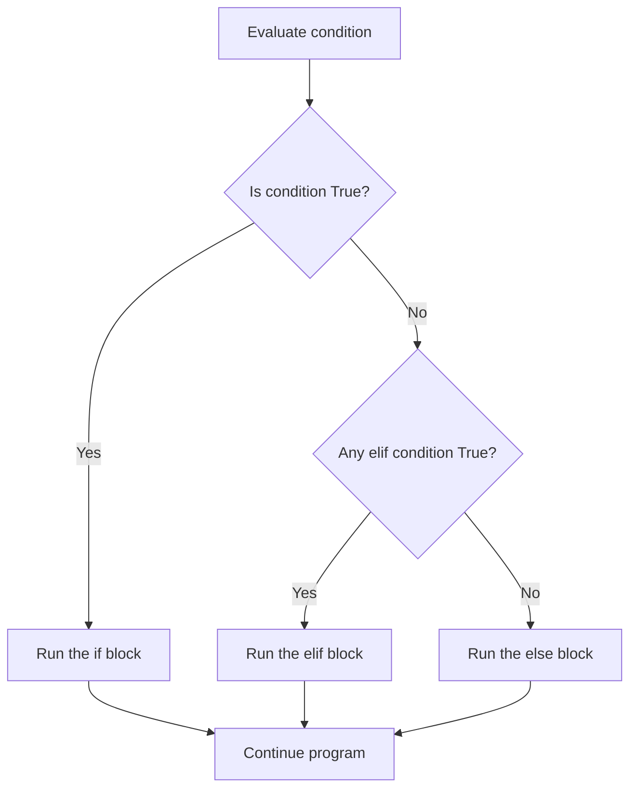

# Python for analytics — introduction

## 1. What You'll Learn in This Section

In this lesson, you'll learn to…

- Explain why Python is the go-to language for data analytics and how it compares to tools like Excel
- Set up and run Python code instantly in Google Colab without installing anything
- Build variables using four core data types and write arithmetic expressions with formatted output
- Apply if/elif/else blocks and for loops to make decisions and repeat actions over data

---

## 2. Detailed Explanation

### Why Python for analytics

Python is a **high-level programming language** — it is written in plain, readable English-like syntax rather than low-level machine instructions.

Guido van Rossum created Python in **1991**. The name comes from the British comedy group **Monty Python**, not the snake. That choice reflects the design philosophy: programming should be fun and simple.

**Why does this matter for analytics?**

Imagine you have a messy spreadsheet with thousands of rows. In Excel, you would click and update each cell one by one. That could take **10 hours**. Python processes the entire file in seconds with a single instruction. Think of it as a programmable assistant — you write what you want done once, and Python does it across all your data automatically.

Here are the key advantages:

- **Open source** — free to download and use, unlike paid tools like MATLAB that require licences
- **Low barrier to entry** — if you can read English, you can read about **80% of Python** code
- **Batteries included** — the standard library that ships with Python is comprehensive enough to handle most common tasks (file I/O, maths, networking, etc.) without installing anything extra; think of it as Python coming pre-loaded with essential tools out of the box
- **Large community** — millions of users share code and solutions freely
- **Portable** — the same code runs on Mac, Windows, and Unix with minimal changes

Python is also an **interpreted language**. Under the hood, Python compiles your source code to an intermediate form called **bytecode**, which a runtime interpreter then executes. Contrast this with a **compiled language** like C, where the entire program is translated directly into machine code before any of it runs. In practice this means you can run a Python script immediately without a separate compile step — the interpreter handles everything. Think of it like translation: a compiler reads a whole book and produces a fully translated edition before you can read any of it; Python's approach is more like a simultaneous interpreter who lets you start listening right away.

Python can also be **extended** (C or C++ modules can be added for performance-critical tasks) and **embedded** (Python can be used as a scripting layer inside applications written in other languages).

---

### Google Colab — your cloud Python lab

**Google Colab** (short for Colaboratory) is a free, browser-based notebook environment provided by Google.

You do not install anything. You open a browser, navigate to Colab, and start writing Python. Google's servers run your code in the cloud.

Benefits at a glance:

- No local setup required
- Saves automatically to Google Drive
- Easy to share notebooks with others
- The same environment everyone in this course uses

To get started: open Google Colab, create a new notebook, give it a name (like "session one"), and start writing code in the cells. Run the cell to see the output appear immediately below it.

Here's the very first program you can run:

```python
print("hello world")
```

The `print()` function displays whatever is inside the parentheses on screen.

---

### Variables and data types

A **variable** is a named container in computer memory that stores a value. Think of it like a labelled bottle: the label (variable name) stays fixed, but the contents (data) can change.

You create a variable using the **assignment operator** (`=`):

```python
ppr = 45
print(ppr)
```

Here `ppr` is the variable name and `45` is the value stored inside it. Running `print(ppr)` outputs `45`.

**Python has four main data types:**

| Data type | What it stores | Example |
|-----------|---------------|---------|
| **Integer** | Whole numbers | `42`, `-7` |
| **Float** | Decimal numbers | `99.02`, `4.8` |
| **String** | Text / characters in quotes | `"Alice"`, `"A1B2"` |
| **Boolean** | Only `True` or `False` | `True`, `False` |

Here's a real example using all four types together:

```python
influencer_name = "Wonder Last Wind"
follower_count = 12500
average_rating = 4.8
is_verified = True
```

`influencer_name` is a **String**, `follower_count` is an **Integer**, `average_rating` is a **Float**, and `is_verified` is a **Boolean**.

**Dynamic typing** means variables in Python are not locked to a type — a variable simply points to whatever object you assign it, and that object carries its own type. You can reassign a variable to a completely different type at any time:

```python
a = 10
a = 100.5
a = 20
print(a)
```

Each line replaces the previous value. Only the last assigned value is stored, so `print(a)` outputs `20`.

**Common mistake — name sensitivity.** Python is **case-sensitive**: `age` and `Age` are two completely different variables. If you assign a value to `user_age` but then try to print `age`, Python raises a `NameError` because `age` was never defined.

---

### Arithmetic expressions and f-strings

Python works as a powerful calculator. It supports:

- Addition `+`, subtraction `-`, multiplication `*`, division `/`, exponentiation `**`

Python follows **BODMAS / PEMDAS** order of operations — Parentheses first, then Exponents, then Multiplication/Division (left to right), then Addition/Subtraction (left to right).

Here's how that plays out:

```python
print(5 * 10 - 4)
```

Multiplication happens first (`5 * 10 = 50`), then subtraction (`50 - 4 = 46`). Output: `46`.

A practical example — calculating a coffee price with tax:

```python
coffee_price = 5.50
tax_rate = 0.08
tax_amount = coffee_price * tax_rate
total_price = coffee_price + tax_amount
print(f"Base price: ${coffee_price}")
print(f"Tax amount: ${tax_amount}")
print(f"Final total: ${total_price}")
```

`tax_amount` works out to approximately `0.44` and `total_price` to approximately `5.94`. (Because computers store decimals in binary, Python may show a long tail like `0.44000000000000006` — that tiny imprecision is normal floating-point behaviour and is not a bug.)

Notice the `f` before the string — that's an **f-string (formatted string)**. Prefix a string with `f` and wrap any variable name in `{}` to embed its value directly in the text:

```python
print(f"Profile name: {influencer_name}")
```

This outputs `Profile name: Wonder Last Wind`. You can even do arithmetic inside the curly braces:

```python
follower_count = 1000
print(f"When you just got 100 new followers, new count is {follower_count + 100}")
```

---

### Decision blocks — if, elif, else

Programs often need to choose between different paths. Python uses **if / elif / else** blocks for this.

The flow works like this:



**Syntax rules:**
- End the condition line with a colon `:`
- Indent the code inside each block consistently — Python's standard style (PEP 8) recommends **4 spaces**, and you must use the same amount of indentation throughout a block; mixing different indentation amounts causes an `IndentationError`
- Use `==` (double equals) to check equality — not `=` (which assigns)
- Comparison operators: `>`, `<`, `>=`, `<=`, `==`

Here's a simple age-gate example:

```python
age = 16
if age >= 18:
    print("Access granted")
    print("Enjoy the movie, don't forget the popcorn")
else:
    print("Access denied")
    print(f"Sorry, you need to be 18, come back in {18 - age} years")
```

With `age = 16`, the `else` block runs and prints "come back in 2 years".

When you need more than two outcomes, add **elif** (else-if) blocks:

```python
purchase_amount = 250
if purchase_amount >= 500:
    discount = 0.20
    message = "You are a gold customer"
elif purchase_amount >= 200:
    discount = 0.10
    message = "You are a silver customer"
else:
    discount = 0.0
    message = "Regular customer"
final_price = purchase_amount * (1 - discount)
print(f"Status: {message}")
print(f"Your final total after {discount * 100}% discount is {final_price}")
```

With `purchase_amount = 250`, the `elif` fires: 10% discount, silver customer, `final_price = 225.0`.

You can also nest an `if` block inside another — a **nested if**:

```python
is_vip = True
budget = 200
if is_vip == True:
    print("Welcome to the VIP lounge")
    print("Here is your complimentary drink")
    if budget > 150:
        print("You can afford the premium model service")
print("Thank you for visiting")
```

The inner `if budget > 150` only runs when the outer `if is_vip == True` is already satisfied. The final `print` always runs regardless.

**Python syntax rules to remember:**

- **Indentation** defines blocks. Lines at the same indentation level belong to the same block. Getting this wrong changes your program's logic entirely.
- **Case sensitivity** — `Age` and `age` are different identifiers.
- **Comments** start with `#`. Python ignores them during execution. Use them to add notes for yourself.

---

### For loops — repeating actions over data

A **for loop** iterates over every item in any **iterable** — a list, string, tuple, or other sequence — and runs the indented block once for each item.

A **list** is a container that holds multiple values:

```python
monthly_revenues = [1200, 1500, 900, 200, 2100]
for revenue in monthly_revenues:
    print(revenue)
```

Python goes through each value in `monthly_revenues` one by one and prints it.

You can combine a for loop with an if/else to classify each item:

```python
monthly_revenues = [1200, 1500, 900, 200, 2100]
for revenue in monthly_revenues:
    if revenue > 1000:
        print(revenue, "excellent")
    else:
        print(revenue, "under target")
```

Results: `1200` → excellent, `1500` → excellent, `900` → under target, `200` → under target, `2100` → excellent.

Python's expressiveness really shows here. A **list comprehension** lets you build a new list by applying an expression to every element of an existing one — all in a single line:

```python
n = [1, 2, 3, 4]
s = [x * x for x in n]
```

`s` stores `[1, 4, 9, 16]` — the square of every element in `n`.

---

## 3. Key Takeaways

- Python is **free, readable, and powerful** — 80% of it reads like plain English, and it handles data tasks that would take hours in Excel in seconds.
- A **variable** is a labelled container. Python supports four main types — integer, float, string, and Boolean — and because Python is dynamically typed, the same variable can point to a different type when you reassign it.
- **Indentation is not optional.** Consistent indentation (conventionally 4 spaces per level) defines which lines belong inside an if block or loop. Wrong indentation means wrong logic or an `IndentationError`.
- **if / elif / else** picks a path based on conditions; a **for loop** runs the same block for every item in a list — combine both to classify data.
- Think of Python libraries as **Lego blocks** — pre-built pieces you snap together to build programs without starting from scratch.