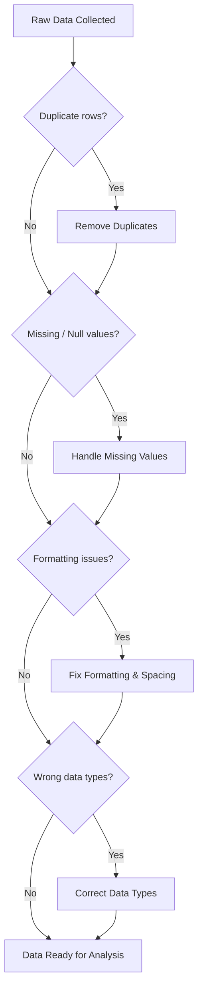

# Excel Essentials Part 1: Data Cleaning

## What You'll Learn

By the end of this lesson, you'll be able to:

- **Recognise data bias** — explain what a dataset is and why inaccurate data leads to wrong answers.
- **Run the standard cleaning checklist** — use TRIM, Split Text to Column, Remove Duplicates, and the data-type selector to prepare a dataset for analysis.
- **Build conditional labels** — use the IF function whenever an outcome is strictly binary (e.g., full-time vs part-time).
- **Aggregate with conditions** — calculate totals, counts, and averages with SUM, COUNT, AVERAGE; filter with SUMIF and COUNTIF.

---

## Dataset Fundamentals and Data Bias

> **Imagine salary data for 100 employees with some values missing.** The average you calculate lands either above or below the true average. The math is right; the data is biased.

### What a Dataset Is

A **dataset** is a collection of data organised in rows and columns. Every row is a single **record** — also called an **entry**. Every column is an **attribute** (also called a feature) describing something about that record.

For example, in an employee dataset, row two might hold one specific employee's details: ID, name, salary, start date, work location. That entire row is one record.

### Why Inaccurate Data Is a Problem

Inaccurate data creates **data bias**. Missing values, wrong values, and null values all count as bias.

Think back to the 100-salary example. If some salary values are missing or wrong, the calculated average drifts above or below the truth. You end up drawing conclusions from numbers that do not tell the real story.

> **Data which is inaccurate is basically biased data. High probability, low probability — it could be anything.**

**Structured data** — like data in an Excel sheet or Google Sheet — is one of the most common formats you will work with.

---

## Data Cleaning: Overview and Standard Sanity Checks

> **Picture a Google Form that people fill in.** Some miss fields, some use the wrong format, some type a completely wrong value. Cleaning fixes all of that before analysis can begin.

### Why You Must Clean Before You Analyse

Data problems do not appear from nowhere. They enter at the point of collection. People filling out a form sometimes:

- miss values entirely,
- use the wrong format,
- enter the wrong data type,
- type a completely wrong value.

**Data cleaning** removes those problems so the data is ready for analysis.

### The Standard Cleaning Checklist

Run these checks on any dataset and the data will be ready 99 times out of 100:

| Step | What to Check | What to Do |
|---|---|---|
| 1 | Duplicate values in the primary column | Remove duplicate rows |
| 2 | Missing values (empty cells, nulls, zeros) | Handle them appropriately |
| 3 | Null or error values | Fix or remove |
| 4 | Formatting (case, spacing, alignment) | Standardise |
| 5 | Data type of each column | Set the right type (number, date, text) |
| 6 | Values in key columns | Validate they are correct |

The **primary column** uniquely identifies each row — for example, **Employee ID** in an employee dataset. Always start cleaning there.

### The Data Cleaning Flow

The diagram shows how data problems enter a dataset and how the cleaning steps remove them one by one.



---

## TRIM: Removing Unwanted Whitespace

> **Someone types ` Rituraj` with a leading space instead of `Rituraj`.** That one invisible character can create data bias the moment you run any operation on the column.

### The Problem TRIM Solves

When someone fills in a form, a leading space sometimes slips in. Doing the fix manually for a few rows is possible. But suppose the dataset has 50,000 rows — by hand is not an option.

### How TRIM Works

The **TRIM function** removes all extra spaces from a cell value. It leaves the text itself plus single spaces between words.

**Syntax:**
```
=TRIM(cell_reference)
```

The `=` sign at the start matters. The equal sign tells the spreadsheet that what follows is a **function**, not plain text. The function appears in the **function bar** (labelled **FX**) as you type.

### Step-by-Step: Applying TRIM to a Column

1. Insert a new column next to the column you want to clean.
2. In the first cell, type `=TRIM(`, click the cell to trim, close the bracket, and press Enter.
3. The trimmed value appears.
4. Apply the formula to all rows: **double-click the small dot** at the bottom-right corner of the cell. The formula fills down to every row with data — all 277 rows in the example dataset.
5. Now **replace the formulas with plain values**. Select the column, press `Control C`, then press `Control V`. In the paste dialog, choose **Paste Values Only**. The cell now stores the actual text rather than the formula.
6. Delete the original column.

### Why "Paste Values Only" Matters

Copy a cell that contains a formula and paste it elsewhere — Excel copies the formula, not the value. The new cell still depends on the original. Delete the original column and all the derived values disappear too.

Pasting as values only breaks that dependency. The text now lives directly in the cell with no formula attached.

> **It is important to remove formulas.** Whenever you write a function and then copy it somewhere, the formula gets copied — not the value. Paste Values Only is the fix.

---

## Split Text to Column: Separating Values in One Cell

> **A Name column holds both first name and last name in one cell.** When you need a separate First Name column and Last Name column, Split Text to Column breaks them apart by a separator like a space or a comma.

### When You Need to Split

Sometimes a column holds multiple pieces of information that belong in separate columns. Whenever values follow a consistent separator — comma, space, semicolon, or another character — you can split them. That separating character is the **separator**.

### How Split Text to Column Works

In Google Sheet:

1. Select the column you want to split.
2. Go to the **Data tab**.
3. Click **Split Text to Column**.
4. A separator dialog appears. Choose Comma, Semi-colon, Period, Space, or Custom — or pick **Detect Automatically** to let the tool figure it out.
5. Confirm. The values split into adjacent columns automatically.

**Worked example from the dataset:**

The Name column has values like `Minerva` combined with a last name, separated by a space. Selecting the column → Data → Split Text to Column → **Space** produces two new columns: First Name and Last Name.

The same technique applied to the Work Location column. That column had a city and a country separated by a comma — for example, `Hyderabad` or `Seattle` combined with a country. **Detect Automatically** split the city into its own City column.

---

## Remove Duplicates: Eliminating Repeated Rows

> **Duplicate rows in a dataset mean the same Employee ID appears more than once.** Remove Duplicates collapses those repeated rows so each record is counted only once.

### Why Duplicates Exist

Duplicate rows enter a dataset when the same entity is recorded more than once — for example, the same Employee ID appearing in two different rows.

### How to Remove Duplicates in Google Sheet

1. Select the dataset (or just the column to dedupe on).
2. Go to **Data → Data Cleanup → Remove Duplicates**.
3. A dialog asks whether the data has a header row. If it does, check **Data has a header row** so the first row is not counted as a duplicate.
4. Select the column(s) for the duplicate check. In the employee dataset that's **Employee ID** — any two rows with the same Employee ID count as duplicates.
5. Click Remove Duplicates.

In the example dataset, **31 duplicate rows** were removed.

> **Removing duplicates on the primary column** (like Employee ID) is the safest choice. Removing duplicates on a column like First Name would also remove rows for people who happen to share a name.

---

## Data Type Formatting: Making Sure Every Column Is What It Claims to Be

> **Salary numbers stored as text break SUM.** The function will not add them. Setting the right data type is what makes calculations possible.

### Why Data Types Matter

Every column has a data type: **number**, **date**, **text**, or **automatic**. The data type controls what operations the spreadsheet can perform on that column.

If a salary column is **text** instead of **number**, formulas like SUM will not work. If a date column is **automatic** instead of **date**, it will not behave as a date.

> If your date is in text format, or your salary is in text format, and you try to do a sum of salaries — it will not work. Always check the data type of your columns.

### How to Set the Data Type

1. Select the column.
2. Look at the data type indicator (it shows **Automatic**, **Number**, **Date**, or **Text**).
3. Click and choose the correct type for the column's content.

**Correct types for the employee dataset:**

| Column | Correct Data Type |
|---|---|
| Salary | Number |
| Start Date | Date |
| Employee ID | Text (or Automatic) |
| Name / Department | Text |

### FTE: Reading the Numbers

**FTE** stands for **Full-Time Employee** in this dataset. The column captures, in a single number per row, whether someone works full-time or part-time. A value of **1** means **full-time employee**. A value **less than 1** means **part-time employee**. Once the column type is confirmed as a number, formulas can use this value directly.

---

## IF Function: Creating Conditional Labels

> **The question "is this employee full-time?" has exactly two possible answers — yes or no.** IF is the function for situations like this: take a condition, route the row to one of two outcomes.

### The Problem It Solves

Suppose the FTE column has numbers (1 or less than 1) and a readable label is needed — "full-time employee" or "part-time employee" — for each row. Formatting alone cannot do this. The label needs logic.

### Syntax of the IF Function

```
=IF(condition, value_if_true, value_if_false)
```

- **condition** — a test that evaluates to true or false
- **value_if_true** — what to display when the condition is true
- **value_if_false** — what to display when the condition is false

Use the IF function **only when there are exactly two possible outcomes** — true or false, 0 or 1, yes or no.

### Worked Example: Labelling Employees

The condition: if FTE is less than 1, the employee is part-time. Otherwise full-time.

```
=IF(V < 1, "part-time employee", "full-time employee")
```

When the FTE cell contains `1`, the condition `V < 1` is false — the result is `"full-time employee"`.
When the FTE cell contains a value less than 1, the condition is true — the result is `"part-time employee"`.

**How to apply it:**

1. In a new column, type `=IF(` and click the FTE cell for the first row.
2. Type `< 1, "part-time employee", "full-time employee")` and press Enter.
3. Drag the formula down (or double-click the dot) to apply it to every row.
4. Copy the column and paste as **Values Only** to remove the formula dependency.

### How the IF Function Flow Works


---

## Aggregation Functions: SUM, SUMIF, COUNT, COUNTIF, AVERAGE

> **Once the data is clean, "what is the complete salary?" or "how many employees work remotely?" become a single function call.** Aggregations collapse a column into one summary number.

### Why Aggregations Matter

After cleaning, totals, counts, and averages answer themselves with one formula. Aggregation functions take a range of values and return a single summary number.

### SUM — Total of All Values

```
=SUM(range)
```

Select the salary column as the range. The function adds every value and returns the total. In the example dataset, the total salary comes out to **1855**.

### COUNT — Count of Values in a Column

```
=COUNT(range)
```

Select the salary column. COUNT returns how many cells in the range contain a numeric value. In the example dataset, the count is **245**.

### SUMIF — Sum Based on a Condition

Use SUMIF to total a column for rows that meet a specific condition.

**Syntax:**
```
=SUMIF(condition_range, condition_value, sum_range)
```

- **condition_range** — the column where you check the condition (e.g., Work Location)
- **condition_value** — the value to match (e.g., `"Remote"`)
- **sum_range** — the column to sum (e.g., Salary)

**Example:** Sum of salaries for all employees working remotely:
```
=SUMIF(I:I, "Remote", salary_column)
```

> If you type the wrong spelling for the condition value (e.g., the wrong spelling for "Remote" or "Seattle"), the function will not throw an error — it returns **0**, because no rows matched.

### COUNTIF — Count Based on a Condition

```
=COUNTIF(condition_range, condition_value)
```

Unlike SUMIF, COUNTIF does not need a separate sum range. You are just counting matching rows — not summing a different column.

**Example:** Count of employees working remotely:
```
=COUNTIF(work_location_column, "Remote")
```

Result: **62 employees** work remotely in the example dataset.

### AVERAGE — Average of All Values

```
=AVERAGE(range)
```

Select the salary column. AVERAGE returns the mean across all values.

### Comparison: When to Use Each Function

| Function | Use When | Needs Condition? | Needs a Separate Sum Column? |
|---|---|---|---|
| SUM | Total of all values in a column | No | No |
| SUMIF | Total for rows matching a condition | Yes | Yes |
| COUNT | Number of values in a column | No | No |
| COUNTIF | Number of rows matching a condition | Yes | No |
| AVERAGE | Mean of all values in a column | No | No |

---

## Key Takeaways

- **Think of data cleaning as the sanity-check loop you run before any analysis.** Duplicates, missing values, formatting issues, wrong data types — these standard checks make the data ready 99 times out of 100. Skip them and every aggregation downstream gets quietly biased.

- **Formulas and values are not the same thing.** When you write a function like TRIM or IF, the cell stores the formula, not the result. Copy and paste — the formula travels with you, not the text. Always use **Paste Values Only** after applying a formula column to lock in the results and break the dependency.

- **Set the data type before running any formula.** A salary stored as text will not sum. A date stored as automatic will not behave as a date. Check the data type of every column before any calculation.

- **IF works for two outcomes only.** Use it when the answer is strictly binary — true or false, 0 or 1, yes or no. One path for true, one path for false. For three or more outcomes, IF alone is not the right tool.

- **SUMIF and COUNTIF answer "how much?" and "how many?" for a slice of the data.** Get the condition value exactly right — wrong spelling silently returns zero, not an error. The match is exact, never approximate.