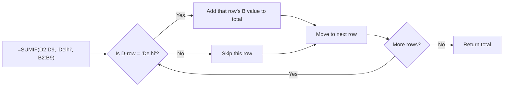
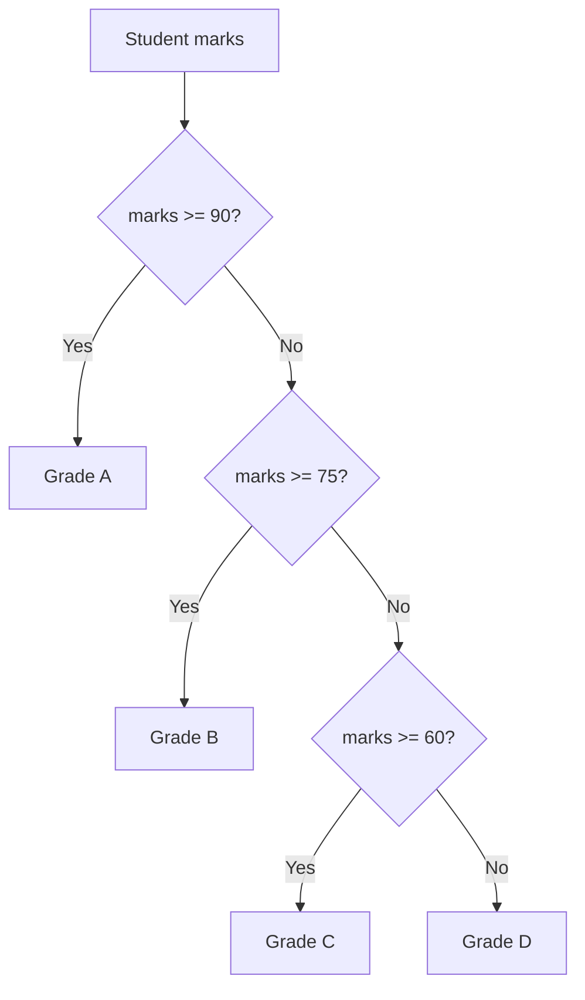

# Conditional Functions and Data Analysis

## What You'll Learn

In this lesson, you'll learn to:

- **Apply SUM, COUNT, SUMIF, and COUNTIF** — use the right aggregation function depending on whether you need a simple total or one filtered by a condition.
- **Write IF statements** — use conditional logic to label, score, or transform data based on a true/false test.
- **Build nested IF formulas** — handle multiple outcome categories (like grade bands A, B, C, D) when a single true/false test is not enough.
- **Use the IFS function** — write cleaner multi-condition formulas in Google Sheets without deeply nesting IF inside IF.
- **Join values with concatenation** — join text and cell values in a single cell using the `&` operator.

---

## Aggregation Functions: SUM, COUNT, SUMIF, COUNTIF

### When to add all values vs. when to filter first

> **Imagine a classroom with 8 students.** Sometimes you want the total marks of the entire class. Sometimes you only want the total marks of students from Delhi. These are different questions — and they need different formulas.

The instructor covered four aggregation functions in this session. Here is how they differ:

| Function | What it does | When to use it |
|---|---|---|
| `SUM` | adds all values in a range | total marks of all students |
| `COUNT` | counts how many cells have values | total number of students in the dataset |
| `COUNTIF` | counts cells that match a condition | how many students scored more than 70 |
| `SUMIF` | adds cells in one column where another column meets a condition | total marks of students from Delhi |

### The SUM and COUNT formulas

```
=SUM(B2:B9)     → adds all marks from rows 2 to 9
=COUNT(B2:B9)   → counts how many values exist in B2:B9
```

Both are straightforward: select the range, close the bracket, press Enter. With 8 students, `COUNT` returned 8.

### COUNTIF: adding a condition to your count

When you need to count only the entries that satisfy a rule, `COUNTIF` adds a condition argument:

```
=COUNTIF(B2:B9, ">70")
```

**Syntax:** two arguments — the range, then the condition.

- **range** — the column where the condition is checked (here: the marks column)
- **condition** — the rule to test (`">70"` means greater than 70)

When the condition is true for a row, the count goes up by 1. When false, nothing happens. There is no third argument because you are not summing — just counting. In the class example, 4 students had marks greater than 70.

### SUMIF: totaling only what matches

`SUMIF` has three parts:

```
=SUMIF(D2:D9, "Delhi", B2:B9)
```

**Syntax:** three arguments in order — condition range, condition, sum range.

- **condition range** — the column where the condition is checked (the city column, D2:D9)
- **condition** — the value to match (`"Delhi"`)
- **sum range** — the column whose values get added when the condition is true (the marks column, B2:B9)

The formula scans the city column. Wherever it finds "Delhi" (students Raj, Anil, and Ria), it adds those students' marks from the B column.



### Why COUNTIF does not need a sum range

`COUNTIF` increments by exactly 1 each time the condition is true. There is no "how much to add" — the increment is always 1. That is why the syntax is just two arguments, not three.

---

## Conditional Statement: IF Else

### What Is a Conditional Statement?

> **Think of a traffic light.** Either it is red (stop) or it is green (go). There is no third state. A conditional statement in a spreadsheet works the same way — one outcome when the condition is true, a different outcome when it is false.

A conditional statement evaluates a condition. The condition is either **true** or **false** — there is no in-between. In a spreadsheet formula, the `IF` function captures this:

```
=IF(A2>=34, "pass", "fail")
```

Three arguments in order:
- **condition** — what you are testing (for example, `A2>=34`)
- **value when true** — what to put in the cell when the condition holds (for example, `"pass"`)
- **value when false** — what to put when it does not (for example, `"fail"`)

### A Simple Pass / Fail Example

The instructor used marks out of 100 with a passing threshold of 34:

```
=IF(A2>=34, "pass", "fail")
```

| Marks | Formula Result |
|---|---|
| 41 | pass |
| 33 | fail |
| 34 | pass |
| 30 | fail |

Students with marks of 33 — which is below 34 — get "fail". Students at 34 or above get "pass". The formula checks the condition and delivers one of the two outcomes.

### A hands-on use case: adding grace marks

The instructor demonstrated a further use: instead of printing "pass" or "fail", the formula can **compute a new value** based on the condition.

The task: if a student fails (marks less than 34), add 5 grace marks to their score. If they pass, keep the marks as-is.

```
=IF(G2>=34, G2, G2+5)
```

- If `G2>=34` is **true** (student passed) → print `G2` (marks unchanged)
- If `G2>=34` is **false** (student failed) → print `G2+5` (marks plus grace marks)

A student with 30 marks would get 35 in the output (30 + 5). A student with 39 marks stays at 39. The formula branched based on the condition.

### Showing a name only when a condition is true

The `IF` function can return text, numbers, or even a blank string:

```
=IF(C9<35, B9, "")
```

This prints the student's name (from B9) only if their marks are below 35. When marks are 35 or above, the cell stays empty — a quick way to build a list of failed students automatically.

### Concatenation: joining a title to a name

A final IF example: add "Mr." before a male student's name, or "Miss" before a female student's name. The `&` operator joins text and cell values:

```
=IF(C15="male", "Mr. "&B15, "Miss "&B15)
```

The `&` in this formula joins the title text with the name in the cell.

The `&` is called **concatenation** — it joins two values together in a single cell. The instructor mentioned this briefly; a deeper dive was reserved for a later session.

---

## Nested IF: handling multiple conditions

### When two outcomes are not enough

> **A single traffic light can only be red or green. But a report card needs four lanes: A, B, C, and D.** A plain `IF` formula can only split traffic into two bins. When you need four, you stack IF formulas inside each other — that is nested IF.

A nested IF is used when there are multiple conditions and multiple possible outcomes. The instructor used a grade-assignment problem:

| Marks range | Grade |
|---|---|
| 90 and above | A |
| 75 to 89 | B |
| 60 to 74 | C |
| Below 60 | D |

### How nested IF flows through conditions

The formula checks conditions in order. Once a condition is true, it assigns the label and stops. Any marks not caught by an earlier condition "fall through" to the next one:



The key insight: because the formula already tagged anyone with marks >= 90 as "A" in the first condition, when the second condition (`A2>=75`) runs, the only students left are those in the 75–89 range.

### Writing the Nested IF Formula

```
=IF(A2>=90, "A", IF(A2>=75, "B", IF(A2>=60, "C", "D")))
```

Each inner `IF` is the false-branch of the outer one. Reading left to right:

1. If marks >= 90 → print "A"
2. If not, and marks >= 75 → print "B"
3. If not, and marks >= 60 → print "C"
4. If none of the above → print "D" (the else branch)

### The IFS function: a readable alternative in Google Sheets

When you stack many nested `IF` statements they become hard to read. Google Sheets provides `IFS` as a cleaner alternative:

```
=IFS(A2>=90, "A", A2>=75, "B", A2>=60, "C", TRUE, "D")
```

**Syntax:** each condition-value pair is listed in order. `TRUE` at the end acts as the "else" — it catches everything that did not match any earlier condition. Without `TRUE` at the end, any row that reaches the last condition without matching could produce an error.

Both nested `IF` and `IFS` produce the same result. `IFS` is simply easier to read and maintain.

---

## Key Takeaways

- **SUM and COUNT are unconditional; SUMIF and COUNTIF add a filter.** Pick the right one based on whether you need all values or only values that meet a rule.
- **COUNTIF needs two arguments; SUMIF needs three.** The extra argument in SUMIF is the sum range — the column whose values get added when the condition is met.
- **An IF statement always produces exactly two possible outcomes.** First value when true, second value when false. The condition is always a binary test.
- **Nested IF handles more than two outcomes** by chaining conditions. The formula checks each condition in order and stops as soon as one is true.
- **IFS is the Google Sheets shorthand for multiple IFs.** Always end the IFS formula with `TRUE` as the last condition to catch all remaining cases — the equivalent of an `else`.
- **Think of nested IF as a decision ladder.** Each rung catches one category. The marks that aren't caught by a higher rung fall to the next one.
- **Concatenation (`&`) joins values in a single cell.** For example, joining the text "Mr. " with the name Rajkumar using `&` produces "Mr. Rajkumar" in one cell.