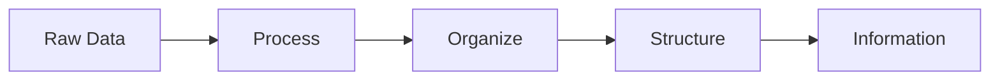

# The Data Landscape and Lifecycle

## What You'll Learn

In this lesson, you'll learn to:
- Define **data**, distinguish it from **information**, and recognize the three types: structured, unstructured, and semi-structured.
- Explain why companies value data through the lens of three analytics branches: **descriptive, predictive, and prescriptive**.
- Walk through the full **data lifecycle** from creation, through ingestion, storage, uses, sharing, archiving, to destruction.
- Compare **batch processing** with **real-time streaming**, and tell apart a **database**, **data lake**, and **data warehouse**.
- Identify the foundational skills (**SQL** and **Python**) that power every data role.

## Foundations for a Data Career

### Why SQL and Python Are the Backbone

Every data role — data scientist, analyst, AI engineer, ML engineer — boils down to two essentials: **SQL** and **Python**. Any library, framework, or tool can follow once these are in place.

A practical sequence works best:

1. Start with **SQL**. Learn how to extract data, manipulate data, and perform actions on data.
2. Once SQL feels comfortable, move to **Python**. Many SQL operations have Python equivalents through libraries, and Python opens the door to data science, AI, and visualization libraries.

Background does not decide the outcome. People from English literature, electrical engineering, and other non-technical paths have moved into data engineering at companies like Amazon by starting with SQL as analysts, then layering Python projects, then growing into BIE and data engineer roles.

> **Industry Spotlight**
> A strong foundation on Python and SQL is the backbone of any data role. Tools and frameworks change, but the data professionals who keep growing are the ones who can extract, manipulate, and reason about data fluently in these two languages first.

### How to Approach the Next Six Months

A consistent effort over six months can shape a first job and launch a career. The same advice applies to anyone newer to coding: when the Python cohort begins, give it extra hours, build more projects than what is assigned, and the comfort develops within a few months. Initially it can feel overwhelming — like learning any new language — but with practice it becomes a cakewalk.

## What Is Data

### A Working Definition

**Data** is any information, collection of information, fact, or statistic. It can take any format: numbers, text, sound, image, or video. If something contains information — in any form — it is data.

That means the picture you scroll past, the audio of a voice note, and a row of numbers in a spreadsheet are all data. Data may exist in its rawest form or in its purest, most usable form, but the defining trait is that it carries information.

### Data vs Information

These two words sound interchangeable, but they are not. The clearest way to remember the relationship:

> Every information is a data, but every data is not information.

Think of it as a set and a subset. Data is the larger set; information is the subset that lives inside it.

### How Data Becomes Information

The diagram captures the core difference:

- **Data** can be raw, unorganized, and ambiguous. It still contains information, but you cannot directly extract value from it as-is.
- **Information** is data that has been processed, organized, structured, and put into a presentable or useful form.

A piece of text could technically be data, yet not be information — until it is cleaned, organized, and shaped into something a person or a system can act on.

## Why Data Matters

### Three Things You Can Do With Data

Once a company has data, three powerful actions become possible. These are not abstract claims; they are the reason every company is hungry for more data.

1. **Describe** — explain what happened in the past.
2. **Prescribe** — recommend what should be done to influence an outcome.
3. **Predict** — estimate what is likely to happen next.

### A Concrete Walkthrough

Imagine a company like Amazon with country-level sales data spanning 2015 through 2025 — roughly ten years of history.

- **Describe**: Looking back at 2015 to understand why sales went down (or went up) in a particular year. The data tells the story of what already happened.
- **Prescribe**: Planning for 2026. If the goal is to increase a metric like sales, revenue, or profit, an analytics team can prescribe specific actions — for example, "If we run this particular ad campaign in the first quarter of 2026, our sales will increase by 28%."
- **Predict**: Forecasting based on past patterns. Across twelve months and four quarters, weather and seasonal conditions vary. With historical data, a team can predict which products will be in demand next month and which will see demand drop in the next quarter.

A second example sharpens the contrast between prescribe and predict: a BI team saying "you are going to lose almost 18% in sales" is making a **prediction**. A BI team saying "run this ad campaign in Q1 to increase sales by 28%" is **prescribing** an action — almost like a doctor's prescription telling someone what to do to get a certain outcome.

### The Three Branches of Analytics

These three actions map directly onto three branches of analytics that the industry talks about:

- **Descriptive** — what happened
- **Predictive** — what will happen
- **Prescriptive** — what one should do to get an outcome

Beyond these three, data is also the **fuel for AI models**. Models are built and trained on data, then used to predict things at scale. Without data, the AI buzz collapses — which is why companies are so focused on collecting more of it.

## Types of Data

Data comes in three forms based on how it is organized.

### Structured Data

**Structured data** lives in rows and columns. If you have ever worked in **Excel** or **Google Sheets**, you have already seen structured data.

Key traits:

- Organized into rows and columns (a tabular form).
- Every element of that data can be accessed at any given point of time.
- Resides in **relational databases** and **data warehouses**.

A spreadsheet with rows 1, 2, 3, 4 and columns A, B, C is the canonical mental picture. A text-based article that fits a clean tabular structure also counts.

### Unstructured Data

**Unstructured data** does not fit a tabular layout. You cannot directly extract or access elements the way you can in a spreadsheet.

Examples:

- Pictures, including social media photos
- Audio files
- Email
- Video files

These carry information, but they are not laid out in rows and columns.

### Semi-Structured Data

**Semi-structured data** is the interesting middle ground. It has *some* structure — you can locate elements within it — but it is not organized into rows and columns.

Common formats:

- **JSON**
- **HTML**
- **XML**

A JSON document, for example, has a clear internal structure (keys, values), but no table to scroll through. It hides some structure without being tabular.

### Side-By-Side Comparison

| Type | Organization | Example |
|---|---|---|
| **Structured** | Rows and columns (tabular) | Excel sheet, Google Sheet, relational table |
| **Unstructured** | No tabular shape; cannot be accessed cell-by-cell | Image, audio, email, video |
| **Semi-Structured** | Has a structure, not tabular | JSON, HTML, XML |

## The Data Lifecycle

Every piece of data a company uses passes through a lifecycle. Understanding this cycle is what is meant by **data literacy** — knowing how data flows and how it works.

### The Full Flow at a Glance

Each stage answers a different question:

- **Create**: Where does the data come from?
- **Ingest**: How does raw input become usable input?
- **Store**: Where does it live?
- **Use**: How do teams turn it into reports and insights?
- **Share**: Who is allowed to access it, and how is it protected?
- **Archive**: What is set aside for the future?
- **Destroy**: What is removed when no longer needed?

### Stage 1: Data Creation

Data creation begins wherever a person enters information into a system. Common sources:

- Filling out a form (for example, a Google Form)
- Signing into a website or installing an application — most apps ask for personal information, mobile number, email, name during sign-up
- Surveys

All of these are sources that feed into the next stage.

### Stage 2: Data Ingestion

**Data ingestion** is the process of taking data in its raw form and converting it into a usable format inside the company's systems. Ingestion happens in two distinct ways.

#### Batch Processing

In **batch processing**, inputs accumulate over time. After a certain trigger — a scheduled time or condition — the entire collected batch is loaded into a table at once.

- Could refresh multiple times per day, once per day, or once per week.
- Frequency depends on the business requirement.
- The name comes from processing data in batches — small groups — rather than continuously.

A simple mental picture: a Google Form collects responses all day; at end-of-day, a trigger fires and the full set of responses is dumped into a table in one go.

#### Real-Time Streaming

In **real-time streaming**, data is stored the moment it is produced. There is no waiting batch.

- Logging into an app and giving information that is ingested instantly is real-time streaming.
- Most modern websites and applications use real-time streaming for user interactions.
- Front-end actions and back-end storage happen simultaneously.

#### Comparing the Two

| Aspect | Batch Processing | Real-Time Streaming |
|---|---|---|
| **When data lands** | After a trigger fires (scheduled) | Immediately, as it is produced |
| **Typical example** | End-of-day form-response dump | App interactions stored as they happen |
| **Frequency** | Multiple times a day, daily, or weekly | Continuous |

### Stage 3: Data Storage

Once data is ingested, it has to live somewhere. There are three main storage formats.

#### Relational Databases

A **relational database** stores structured data in tables that can form **relations** with each other — that is the reason for the word "relational." Tables can be connected to each other based on shared columns.

Examples:

- **MySQL**
- **PostgreSQL**

#### Data Lake

A **data lake** is used to store **unstructured and semi-structured data**, especially at large scale. Think of it as a large tank that can hold many formats.

Example:

- **Amazon S3** (from Amazon Web Services) is a data lake.

Data lakes are typically cheaper than warehouses but cannot store data in the structured, query-ready way warehouses can.

#### Data Warehouse

A **data warehouse** stores data in a structured form intended for reporting, analysis, and extraction. Warehouses are more expensive for large volumes but optimized for analytical workloads.

Examples:

- **Amazon Redshift**
- **Google BigQuery**

#### Storage at a Glance

| Storage | Holds | Examples |
|---|---|---|
| **Relational Database** | Structured data in related tables | MySQL, PostgreSQL |
| **Data Lake** | Unstructured + semi-structured data | Amazon S3 |
| **Data Warehouse** | Structured data for reporting and analysis | Amazon Redshift, Google BigQuery |

These three go hand in hand inside most companies — each plays a role storage-wise.

### Stage 4: Data Uses

Once data is stored, the next question is: how do teams use it? This is where reporting and analytics live.

A common end-to-end flow:

1. Gather data from sources.
2. Land it in the warehouse, where it is stored.
3. The warehouse holds tables (and a data lake holds the less-structured pieces).
4. A **BI layer** sits on top — this is where you write **SQL** or **Python** to extract data.
5. Connect that extracted data to a reporting tool to build dashboards and reports.

Reporting and dashboarding tools commonly used:

- **Excel**
- **Power BI**
- **Tableau**
- **Looker**

Before reporting, the data is not just shown as-is. Business logic is applied — using SQL or Python — to format and shape it. The raw stored table is rarely the final report.

You may also hear the term **ETL** — Extract, Transform, Load. It is the engine behind moving data from sources, transforming it, and loading it into the warehouse for use. The details come later in the SQL learning path.

### Stage 5: Sharing

Once data is in use, it gets shared across teams. The two big concerns at this stage:

- **Access** — who is allowed to read what
- **Security** — keeping the data protected

Two key actions live here:

- **Encryption**
- **Authentication**

In most companies, a separate data quality or platform team handles these — encryption, access control, authentication are typically provided to you, not something each analyst configures themselves.

Sharing also includes the act of writing SQL queries against warehouse data so that other people can extract what they need.

### Stage 6: Archiving

**Archiving** is about restricting and preserving. When certain data should be available only to certain people — not everyone in the company — permissions are placed so that only authorized roles can look at it. The data stays accessible, but only behind controls.

### Stage 7: Destroying

Once data is no longer useful, the final step is **destroying** it — deleting it from the data warehouse to free up space. In practice, modern companies rarely destroy data, but the lifecycle still includes this step.

## Data Quality

A storage stack and a lifecycle are only as good as the quality of the data flowing through them. **Data quality** sounds simple but is critical when the goal is data that is actually usable.

### What Data Quality Checks Look For

When preparing data for use, certain checks run:

- Is duplicacy allowed? Are duplicates present?
- Is the data clean and in the expected structure?
- Are values missing?
- Are calculations correct?

When the data is accurate, the quality is good.

### The Four Major Steps for Data Quality

1. **Profiling** — patching and examining data to understand its shape. Right-typing the data is part of profiling.
2. **Cleaning** — fixing the data so it is usable.
3. **Validation** — confirming the data meets expected rules; ETM processes are used here.
4. **Governance** — ongoing oversight so quality holds up over time.

### Tools You Will See

- **Informatica** — used for profiling.
- **Alteryx** — used for cleaning, including in real-time scenarios.
- ETM processes for validation.

> **Industry Spotlight**
> Data quality is rarely the headline of a project, but unusable data can quietly invalidate every dashboard, every model, and every business decision built on top of it. That is why companies invest in profiling, cleaning, validation, and governance as a standing discipline — not a one-time fix.

## Data Warehouse vs Data Lake

This contrast is a common interview question, so it is worth pinning down clearly.

| Dimension | Data Warehouse | Data Lake |
|---|---|---|
| **Data type** | Structured | Can also include semi-structured data |
| **Cost at large volumes** | Expensive | Cheaper |
| **Storage capacity for diverse formats** | Limited to what a warehouse handles | Can store the kinds of data a warehouse cannot |

The takeaway: warehouses are tuned for structured, query-ready, analytical workloads, while lakes absorb the broader, messier set of formats at lower cost.

## Key Takeaways

- **Data is any information** — numbers, text, sound, image, or video. Information is the structured, useful subset of data; every information is data, but every data is not information.
- **The value of data comes from three actions**: describe what happened, prescribe what to do, and predict what will happen — mapping to descriptive, predictive, and prescriptive analytics.
- **Three types of data** to recognize: structured (rows and columns, like Excel), unstructured (images, audio, email, video), and semi-structured (JSON, HTML, XML).
- **The data lifecycle flows in stages**: create → ingest → store → use → share → archive → destroy. Ingestion happens through batch processing or real-time streaming; storage happens in relational databases, data lakes, or data warehouses.
- **Every stage of the lifecycle exists** so that SQL, Python, and tools like Excel, Power BI, Tableau, and Looker can turn raw inputs into reports, dashboards, and the data foundation that AI models eventually rely on.