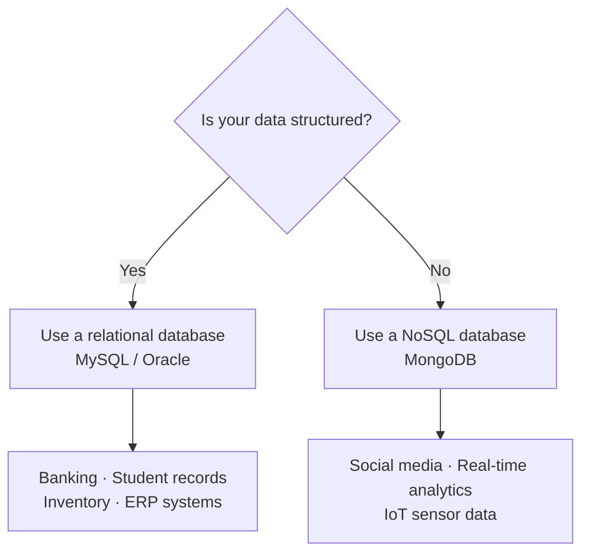
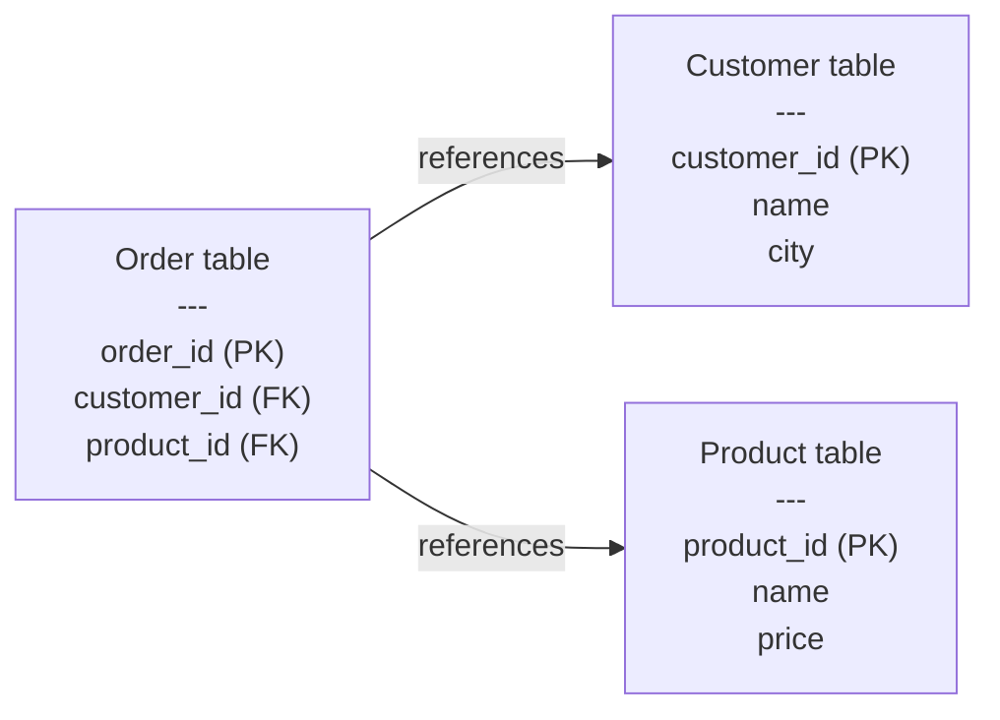

# SQL Fundamentals and Relational Databases

## Whiteboard Notes: [SQL WhiteBoard](https://coding-platform.s3.amazonaws.com/dev/lms/tickets/f53342f3-2239-4ccb-a900-49af3931c156/lVRUyXTAqJQg3dZj.pdf)


## 1. What You'll Learn in This Section

This section covers the fundamentals of SQL and relational databases — the foundational skills every data professional needs. By the end, you'll be able to:

- Explain what SQL is and why every data-driven application depends on it
- Identify the four CRUD operations and map them to real database tasks
- Distinguish between relational (SQL) and NoSQL databases and choose the right one
- Define fundamental relational concepts — table, row, column, primary key, and foreign key
- Set up MySQL Community Server and MySQL Workbench on your machine

## 2. Detailed Explanation

### Why databases exist — the e-commerce example

A **database** is an organised collection of data held in related tables. Think of it as a well-indexed filing cabinet where every drawer, folder, and sheet is labelled and linked.

**Why it matters**

Before you write a single SQL query, it helps to see the real problem databases solve. When you browse Amazon or Flipkart and search for a laptop, the platform needs to find the right products instantly — from millions of records. A spreadsheet cannot do that at scale.

**Walkthrough**

A platform like Amazon stores data in three core tables:

| Table | Key columns |
|---|---|
| Customer | `customer_id`, `name`, `city` |
| Product | `product_id`, `name`, `price` |
| Order | `order_id`, `customer_id`, `product_id` |

The `customer_id` and `product_id` columns in the order table link all three tables together. When you search for a laptop, the application runs a query like this:

```sql
SELECT * FROM products WHERE name = 'laptop';
```

That query scans the `products` table and returns every matching row — Samsung laptop, Dell laptop, HP laptop, Apple laptop, and so on. The platform then displays those results to you.

Food delivery platforms like Swiggy and Zomato use the exact same three-table pattern: a customer table, a food-items table, and an orders table. When you place an order, an SQL query fetches the matching customer and product records and kicks off fulfilment.

**Common mistakes**

- Thinking each app needs its own custom storage format — in reality, almost all data-driven apps share this relational table pattern.
- Confusing the order table with a receipt — it is just a mapping of who ordered what, not a formatted document.

---

### What SQL is

**SQL** stands for **Structured Query Language**. It is the language you use to store, retrieve, modify, and delete data inside a database.

**Why it matters**

SQL is the bridge between your application and the database. Your app sends SQL commands; the database executes them and returns results. Without SQL, there is no standard way to talk to a relational database.

**Walkthrough**

A compact working definition: SQL = the means of interaction between an application and a database.

SQL is not tied to one vendor. Standard SQL, MySQL, and SQLite are all dialects of SQL. SQLite is a lightweight version — some features are present, some are not. The concepts here follow standard SQL as implemented in MySQL.

The librarian analogy captures SQL's role well. A library is like a database; the librarian is like SQL. When a reader asks for a book on database management, the librarian searches the entire catalogue and retrieves it. In SQL:

```sql
SELECT * FROM library WHERE name = 'DBMS';
```

This tells the system: search the entire `library` table and return every row whose `name` column matches `'DBMS'`.

**Common mistakes**

- Treating MySQL, SQLite, and standard SQL as completely different things — they are dialects of the same language, sharing most syntax.
- Assuming SQL only reads data — SQL also creates, updates, and deletes data.

---

### Why not use spreadsheets

A **spreadsheet** is a manual grid tool where you inspect each cell and row yourself. SQL databases are purpose-built for scale.

**Why it matters**

This is where beginners often get stuck: "I already use Excel, why learn SQL?" The answer is scale and structure.

**Walkthrough**

Spreadsheets require manual inspection of every row. They cannot handle the volume of data that real applications generate. The Amazon product and customer database is far beyond what any spreadsheet can represent or manage.

SQL, by contrast, is designed to:
- Handle huge volumes of data efficiently
- Enforce structure so data stays consistent
- Run complex queries in milliseconds

**Common mistakes**

- Using a spreadsheet to prototype data and assuming you can "upgrade later" — the structure of a relational schema needs to be designed upfront.

---

### CRUD — the four database operations

**CRUD** is the acronym for the four fundamental operations every database system must support: **Create**, **Read**, **Update**, and **Delete**.

**Why it matters**

Every action you take in any app maps to one of these four operations. Understanding CRUD tells you what SQL can do at a high level before you learn the individual commands.

**Walkthrough**

| Operation | What it does | Example |
|---|---|---|
| **Create** | Add new records | Insert a new customer row |
| **Read** | Retrieve records | Fetch all laptops from the product table |
| **Update** | Modify existing records | Change a customer's city |
| **Delete** | Remove records | Delete a cancelled order |

Good data management also requires that stored data stays:
- **Organized** — structured so it can be found and used
- **Accurate** — the right product is matched to the right order (a customer who orders a cricket bat gets a cricket bat, not a football)
- **Consistent** — no contradictions across tables
- **Secure** — unauthorised users cannot access or modify records
- **Available** — data can be retrieved at any time

**Common mistakes**

- Confusing Create with Read — Create adds new data; Read retrieves existing data.
- Forgetting that Delete is permanent unless you have backups.

---

### Real-world SQL use cases

SQL operates invisibly behind almost every data-driven application you use daily.

**Why it matters**

Knowing where SQL appears in the real world helps you understand what you are building toward.

**Walkthrough**

- **Ticket booking** — every reservation system queries and updates a table of available seats.
- **ATMs** — cash withdrawals and deposits trigger SQL read and write operations against account records.
- **Food ordering** — Swiggy, Zomato, and similar apps query item catalogues and create order records.
- **Universities** — student records, marks, and reports live in relational tables.
- **Banking systems** — account balances, transactions, and customer records rely on SQL.
- **Inventory systems** — product availability and stock levels are tracked in relational tables.

The general principle: wherever data is collected or stored, SQL is working in the background.

**Common mistakes**

- Assuming SQL is only for "big tech" — even a small university or local bank runs SQL behind the scenes.

---

### Relational databases vs NoSQL databases

A **Relational Database Management System (RDBMS)** stores data in structured tables with explicit relationships between them. A **NoSQL database** stores data in a flexible format without requiring a fixed schema.

**Why it matters**

Choosing the wrong database type causes serious problems later. Understanding the difference is one of the first architectural decisions a developer makes.

**Walkthrough**



**Relational databases (RDBMS)**

- Data must conform to a predefined schema.
- Tables have explicit relationships enforced through keys.
- Examples: **MySQL**, **Oracle**.
- Best for: banking systems, student databases, inventory systems, ERP systems, university management.

**NoSQL databases**

- No fixed schema — data shape can change freely.
- No enforced relationships between data stores.
- Example: **MongoDB** (a document store).
- Best for: social media applications, real-time data analysis, IoT sensor data.

**Decision rule:** structured data → use SQL (relational); unstructured data → use NoSQL.

**Common mistakes**

- Defaulting to NoSQL because it sounds "modern" — if your data has consistent structure and relationships, a relational database is the right choice.
- Using a relational database for rapidly changing, schema-less data — that is what NoSQL is designed for.

---

### Core relational concepts — table, row, and column

A relational database is built from three building blocks: **tables**, **rows**, and **columns**.

**Why it matters**

Before you can write queries or design a schema, you need a precise vocabulary for these building blocks. Every SQL statement you will ever write refers to at least one of them.

**Walkthrough**

A **table** (also called a **relation**) is the fundamental storage unit. Data sits in a structured grid of named columns and typed values.

A **row** (also called a **tuple**, **record**, or **instance**) represents one complete entry. In a student table, each row is one student's full record.

A **column** (also called an **attribute**) describes one property of the entity. For example, a `branch_name` column in a student table holds the branch of study for every row. Columns have defined data types — integer, character string, and so on.

Here is a concrete example — the `city` table from the world database:

| Column | Data type | Description |
|---|---|---|
| `id` | INTEGER | Unique identifier for each city |
| `name` | CHAR | City name |
| `country_code` | CHAR(3) | Three-character country code |
| `district` | CHAR(20) | District or state name |
| `population` | INTEGER | City population |

This table contains approximately 1,000 rows. It is part of the **world database** that you will load into MySQL Workbench, alongside `country`, `country_language`, and `sports` tables.

**Common mistakes**

- Calling a row a "column" or vice versa — rows go across (horizontal); columns go down (vertical).
- Forgetting that columns have data types — storing a city population as a CHAR instead of an INTEGER will cause problems later.

---

### Primary key and foreign key

A **primary key** uniquely identifies each row in a table. A **foreign key** links one table to another by referencing that primary key.

**Why it matters**

Keys are how relational databases stay consistent. Without a primary key, rows could duplicate. Without a foreign key, tables would be disconnected islands of data.

**Walkthrough**



**Primary key rules:**
- Every table should have a primary key column.
- No two rows can share the same primary key value.
- The `customer_id` column in the customer table is the primary key for that table.

**Foreign key rules:**
- A foreign key in one table references the primary key of another table.
- The `customer_id` column in the order table is a foreign key — it points back to the customer table's `customer_id`.
- Similarly, `product_id` in the order table is a foreign key pointing to the product table.

This linkage is what lets a query join the order table with the customer table to find out who placed which order.

**Common mistakes**

- Confusing a foreign key with a duplicate primary key — the foreign key lives in a different table and references the primary key, it does not copy it.
- Omitting a primary key — without one, you cannot uniquely identify a row and joins become unreliable.

---

### Installing MySQL Community Server and MySQL Workbench

**MySQL Community Server** is the open-source database engine. **MySQL Workbench** is the graphical interface for writing and running SQL queries against that engine.

**Why it matters**

You cannot practice SQL without a running database server. Setting this up correctly from the start saves hours of debugging later.

**Walkthrough**

**Step 1 — Install MySQL Community Server**

1. Go to `mysql.com` and navigate to **Downloads**.
2. Select **MySQL Community Edition**, then **MySQL Community Server**.
3. Download the installer that matches your operating system (Windows or macOS) — the page auto-detects your OS.
4. Run the installer. When asked for a setup type, select **Typical** and keep all defaults.
5. During installation, create a **root user** and set a password. You will need this password every time you connect to the MySQL server.
6. On Windows, if Visual Studio components are missing, resolve those errors before continuing.

**Step 2 — Install MySQL Workbench**

1. Return to the MySQL downloads page, go to **MySQL Community Edition**, and select **MySQL Workbench**.
2. Download and install MySQL Workbench.

Once installed, MySQL Workbench shows:
- A **schemas panel** on the left listing all databases.
- **Tables**, **views**, and **functions** nested under each schema.
- A **SQL query editor** in the main pane where you type and run queries.

The MySQL command-line client is also installed alongside the server, but MySQL Workbench is the tool you will use for this course.

**Common mistakes**

- Forgetting to save the root user password — you cannot log in without it, and resetting it is a multi-step process.
- Skipping the Visual Studio prerequisite check on Windows — the MySQL installer will fail silently or partially if those components are missing.

---

## 3. Key Takeaways

- **SQL (Structured Query Language)** is the bridge between an application and a database. It lets you store, retrieve, modify, and delete data using four fundamental CRUD operations: Create, Read, Update, Delete.
- **Relational databases (RDBMS)** like MySQL store data in structured tables with enforced relationships; **NoSQL databases** like MongoDB handle schema-flexible data. Decision rule: structured data → SQL; unstructured data → NoSQL.
- Every relational table has **rows** (individual records) and **columns** (named properties with data types). These are the fundamental building blocks: a primary key uniquely identifies each row; a foreign key links one table to another.
- SQL runs behind virtually every data-driven system — ticket booking, ATMs, food delivery, banking, student records, and inventory — because spreadsheets cannot handle the scale or enforce the required structure.
- Setting up MySQL requires two installs: **MySQL Community Server** (the database engine) and **MySQL Workbench** (the graphical interface). Keep your root password safe — you will need it every session.

**Mental model:** Think of a relational database as a set of spreadsheet tabs that are aware of each other. Primary keys act as unique row IDs; foreign keys link one tab to another. SQL is the librarian who knows exactly where every piece of data lives.