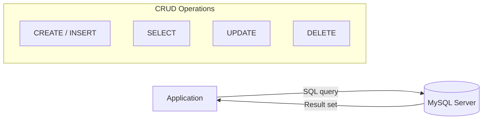

# SQL Querying with MySQL Workbench — Tables, Data Types, and CRUD

## 1. What You'll Learn in This Section

In this lesson, you'll learn to:

- Explain what SQL is and how it connects applications to a relational database using the CRUD model.
- Set up MySQL Community Server and MySQL Workbench on your machine.
- Create tables with typed columns using `CREATE TABLE`.
- Insert data into a table using `INSERT INTO` and read it back with `SELECT *`.

---

## 2. Detailed Explanation

### SQL and Its Role as a Database Bridge

**SQL (Structured Query Language)** is the query language that acts as a bridge between a database and the user or application that wants to read or write data. Think of it as the common language a cashier and a stockroom system both understand — your application speaks SQL, the database engine (like MySQL) understands SQL, and data flows cleanly in both directions.

**Why it matters**

Every application that stores data — a student portal, an e-commerce site, a hospital system — needs to talk to a database. SQL is the universal translator that makes that conversation possible. Without it, applications would have no standard way to ask "give me all orders placed today" or "add a new user."

**Walkthrough**

MySQL is one widely used database engine that implements SQL. When a web application needs to fetch a user's profile, it sends an SQL query to MySQL. MySQL processes it and returns the result. The application never touches the raw data files — SQL handles everything.

**Common mistakes**

- Confusing MySQL (the database engine) with SQL (the language). MySQL is a tool that understands SQL; SQL itself is not a piece of software you install.

---

### The CRUD Model

**CRUD** is an acronym for the four fundamental operations that any SQL system supports: **Create**, **Read**, **Update**, and **Delete**.

**Why it matters**

Almost every database task — whether you are building a new feature or debugging a data issue — maps to one of these four operations. Knowing the CRUD label for an action tells you exactly which SQL keyword to reach for.

**Walkthrough**

| Letter | Operation | SQL keyword |
|--------|-----------|-------------|
| C | Create — add new tables or rows | `CREATE`, `INSERT` |
| R | Read — retrieve data | `SELECT` |
| U | Update — modify existing data | `UPDATE` |
| D | Delete — remove tables or rows | `DELETE` |

This lesson focuses on **Create** (building tables with `CREATE TABLE` and adding rows with `INSERT INTO`) and the beginning of **Read** (retrieving data with `SELECT *`). Update and Delete exist in SQL but are not demonstrated here.



**Common mistakes**

- Trying to use `DELETE` or `UPDATE` before understanding `SELECT` — always verify what data exists before modifying it.

---

### Setting Up MySQL and MySQL Workbench

**MySQL Community Server** is the database engine that stores and manages your data. **MySQL Workbench** is the graphical user interface (GUI) you use to write SQL queries and connect to that engine. They are two separate downloads.

**Why it matters**

Without the server, there is no database to query. Without Workbench, you have no convenient way to write and run queries visually. Together they form the complete local development environment for SQL.

**Walkthrough**

Both tools are free. Download them from `www.mysql.com` under *Downloads → MySQL Community Downloads*.

1. Download **MySQL Community Server** — the page auto-detects your OS (Windows or macOS).
2. Download **MySQL Workbench** from the same page.
3. Neither download requires creating an account. On the download prompt, choose "No thanks, just start my download."

**Installation steps:**

- Run the Community Server installer. Keep all default settings.
- At one point you must set a **root password** — write it down, because Workbench requires it every time it connects to your local server.
- Run the MySQL Workbench installer. Keep defaults and click Next through all steps. On macOS, the installer asks for your system login password.
- If a **Visual Studio redistribution** error appears on Windows during Workbench installation, install the Visual Studio 2019 redistributables to fix it.

After installation, open MySQL Workbench from your system search. A **local instance** tile appears on the home screen. Click it, enter your root password, and the main interface opens.

**Common mistakes**

- Forgetting the root password set during installation. There is no "forgot password" prompt — write it down before clicking Next.
- Installing only Workbench without the Community Server. Workbench is just a GUI; it has nothing to connect to without the server running.

---

### The MySQL Workbench Interface

The Workbench window has three main areas you will use for basic querying: the **Navigator** on the left, the **query editor** in the centre, and the **execute toolbar** above the editor.

**Why it matters**

Knowing where to click before you type your first query saves frustrating trial and error. Each panel has a specific job.

**Walkthrough**

**Left panel — Navigator**

The Navigator has two tabs:

- **Administration** — server management tools (server status, client connections, user privileges). You do not need this tab for basic querying.
- **Schemas** — lists every database on your local server. This is the tab you will use most.

**Default databases**

After a standard installation with Sakila and World databases selected during setup, three databases appear under Schemas:

| Database | Purpose |
|----------|---------|
| `sakila` | Sample entertainment database provided by MySQL; great for learning |
| `sys` | Internal MySQL system database — do not create tables here |
| `world` | Sample geographic database provided by MySQL |

**Activating a database**

Double-click a database name in the Schemas panel. The name turns **bold**, meaning it is now active. Every query you run will target that database. If you try to create a table without activating a database first, MySQL returns a "No database selected" error.

**Central panel — Query editor**

The large text area in the centre is where you type SQL. The toolbar above it has several execute icons:

| Icon | Action |
|------|--------|
| 1st (yellow lightning) | Execute the entire script |
| 2nd (yellow lightning, partial) | Execute only the selected portion |
| 3rd | Execute the single statement under the cursor |
| 4th | Explain (show the execution plan for) the statement under the cursor |

You can also save queries to a `.sql` file and re-open them using the save and open-script icons.

**Common mistakes**

- Staying on the Administration tab instead of Schemas when trying to find your tables.
- Forgetting to double-click the database before writing queries — always confirm the target database name is bold.

---

### Data Types

A **data type** tells MySQL what kind of value a column can hold — whole numbers, text, dates, and so on. Every column in a `CREATE TABLE` statement must have a data type.

**Why it matters**

Data types enforce correctness. If an age column is typed as `INT`, MySQL rejects any attempt to store the text "twenty-one" there. This prevents bad data from entering your tables.

**Walkthrough**

Three fundamental data types are covered here:

| Data type | Description | Example use |
|-----------|-------------|-------------|
| `INT` | Integer (whole number) | Student ID, age |
| `VARCHAR(n)` | Variable-length string up to *n* characters | Name, department name |
| `DATE` | Calendar date | Date of birth |

MySQL supports many additional data types. Exploring the full set is recommended as independent study.

**Common mistakes**

- Using `VARCHAR` without specifying a length, e.g. `VARCHAR` instead of `VARCHAR(50)`. Always include the number in parentheses.
- Storing numbers in a `VARCHAR` column when arithmetic on that column might be needed later.

---

### Creating Tables — `CREATE TABLE`

`CREATE TABLE` is the SQL statement that defines a new, empty table inside the active database.

**Why it matters**

Before you can store any data, the structure must exist. `CREATE TABLE` is the blueprint step — it defines what columns the table has and what type of data each column accepts.

**Walkthrough**

```sql
CREATE TABLE table_name (
    column1_name data_type,
    column2_name data_type,
    column3_name data_type
);
```

- Write `CREATE TABLE` followed by the table name.
- Inside parentheses, list each column name and its data type, separated by commas.
- Close the parenthesis and end with a semicolon.

**Example — students table**

```sql
CREATE TABLE students (
    SID        INT,
    name       VARCHAR(50),
    age        INT,
    department VARCHAR(50)
);
```

After clicking the execute icon, Workbench shows: "CREATE TABLE students … Number of rows affected: 0". That confirms the table was created with no rows yet.

**Example — stud1 table (adds a date column)**

```sql
CREATE TABLE stud1 (
    SID           INT,
    name          VARCHAR(50),
    age           INT,
    department    VARCHAR(50),
    date_of_birth DATE
);
```

This adds a `DATE` column to the same structure, demonstrating how to include date fields.

**Viewing the new table**

After running `CREATE TABLE`, click the **refresh** icon next to Schemas in the Navigator. The new table appears under the active database's Tables node. Confirm the schema by running:

```sql
SELECT * FROM students;
```

Before inserting any rows, this returns the column headers with zero data rows — the table exists but is empty.

**Common mistakes**

- Forgetting to close the parenthesis at the end of the column list. Workbench highlights the syntax error.
- Running `CREATE TABLE` without first activating a database. The query fails with "No database selected."

---

### Reading Data — `SELECT *`

`SELECT *` is the simplest SQL query. It retrieves every column and every row from a table.

**Why it matters**

`SELECT *` is the Read (R) in CRUD. You will use it constantly to verify that your inserts worked, to inspect table contents, and to understand what data exists before writing more complex queries.

**Walkthrough**

```sql
SELECT * FROM table_name;
```

The `*` means "all columns." Running this on an empty table returns just the column headings with zero rows. Running it on a populated table returns all data.

**Example — reading the actor table in the Sakila database**

```sql
SELECT * FROM actor;
```

When `sakila` is the active database, this returns all rows from the `actor` table, including columns such as actor ID, first name, last name, and last update timestamp.

**Common mistakes**

- Running `SELECT * FROM students` while a different database is active. If `students` does not exist in that database, MySQL returns a "Table doesn't exist" error.

---

### Inserting Rows — `INSERT INTO`

`INSERT INTO` adds one or more new rows of data to an existing table.

**Why it matters**

`CREATE TABLE` builds the empty structure. `INSERT INTO` fills it with real data. Without this step, all your tables would stay empty.

**Walkthrough**

There are three forms to know.

**Form 1 — explicit column list**

```sql
INSERT INTO students (SID, name, age, department)
VALUES (9001, 'Raja', 21, 'CSE');
```

- The column list in parentheses after the table name specifies the order in which values are provided.
- `VALUES` supplies the actual data for one row.
- String values go inside single or double quotation marks.
- Integer values are written without quotes.

After executing, running `SELECT * FROM students` returns one row: `9001 | Raja | 21 | CSE`.

**Form 2 — no column list (column order must match CREATE TABLE)**

If your values are in exactly the same order the columns were defined, you can omit the column list:

```sql
INSERT INTO students
VALUES (9002, 'Sita', 18, 'CSE');
```

The order of values must exactly match the column order from `CREATE TABLE`.

**Form 3 — multiple rows in one statement**

```sql
INSERT INTO students (SID, name, age, department)
VALUES
    (9001, 'Raja', 21, 'CSE'),
    (9002, 'Sita', 18, 'CSE');
```

Separate each row's `VALUES` tuple with a comma. One statement inserts both rows at once.

**Common mistakes**

- Omitting quotes around string values. MySQL will throw a syntax error or misinterpret the value as a column name.
- Using Form 2 (no column list) when the value order does not match the `CREATE TABLE` column order. Data ends up in the wrong columns, and MySQL shows no error.

---

### Case Sensitivity in MySQL

MySQL query keywords and identifiers are **not case-sensitive**.

**Why it matters**

New SQL writers often wonder whether they must capitalise keywords like `SELECT` and `CREATE`. They do not. MySQL treats `SELECT`, `select`, and `Select` as identical.

**Walkthrough**

`CREATE TABLE Students` and `CREATE TABLE students` refer to the same object. Column names and table names typed in any case are treated the same way. Convention is to capitalise SQL keywords (`SELECT`, `FROM`, `INSERT`) and use lowercase for table and column names, but MySQL itself does not enforce this.

**Common mistakes**

- Assuming case matters and spending time debugging a query that is correct but uses mixed-case keywords.

---

## 3. Key Takeaways

- SQL is the standard language that connects applications to relational databases, and every SQL operation fits one of four CRUD categories: Create, Read, Update, or Delete.
- MySQL Community Server (the engine) and MySQL Workbench (the GUI) are both free to download from `www.mysql.com`; the root password set during installation is required every time Workbench connects.
- Always double-click a database in the Schemas panel to make it active (its name turns bold) before running any `CREATE TABLE` query.
- The three core data types for building tables are `INT` (whole numbers), `VARCHAR(n)` (text up to *n* characters), and `DATE` (calendar dates).
- `INSERT INTO` supports an explicit column list, a column-list-omitted shorthand, and multi-row insertion in a single statement.
- Run `SELECT *` immediately after an insert to verify the data landed correctly.

**Mental model:** Think of SQL as a conversation with a filing system. `CREATE TABLE` builds a new filing cabinet with labelled drawers. `INSERT INTO` drops documents into those drawers. `SELECT *` tips the cabinet out so you can see everything inside.