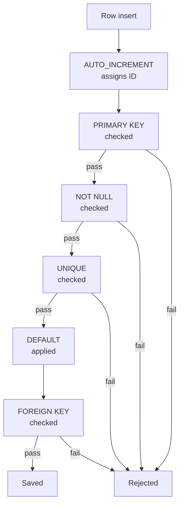

# SQL Database Creation, Tables, Constraints, and Data Insertion

## 1. What You'll Learn in This Section

In this lesson, you'll learn to:

- Create a MySQL database and select it as the active working environment
- Define tables with typed columns and apply constraints to protect data quality
- Insert rows into tables and retrieve data using SELECT queries
- Apply arithmetic expressions and the COUNT function inside SELECT statements

## 2. Detailed Explanation

### MySQL Workbench — your working environment

**MySQL Workbench** is a graphical tool for writing and running SQL statements against a MySQL database server.

**Why it matters**

Before you can write any SQL, you need a place to run it. MySQL Workbench gives you a visual interface where you can see your databases, run queries, and immediately check whether they succeeded or failed.

**Walkthrough**

When you open MySQL Workbench, look at the left-hand side. The **Schemas panel** (also called the Navigator) lists every database on your server. Inside each database you can expand to see its tables, views, stored procedures, and functions.

Key controls to know:

- **Execute Statement Under Keyboard Cursor** — the fourth icon in the toolbar. Place your cursor on a single SQL line and click this to run only that one statement, not the entire script.
- **Green status indicator** — the statement ran successfully.
- **Red status indicator** — an error occurred; read the message at the bottom to fix it.
- After you create or change a database object, right-click in the Schemas panel and choose **Refresh** to see the updated list.

**Common mistakes**

- Running the entire script when you only want to test one line — use "Execute Statement Under Keyboard Cursor" instead of the "Run All" button.
- Forgetting to refresh the Schemas panel after creating a table — the new table exists in the database but won't appear in the list until you refresh.

---

### Creating and selecting a database

A **database** is a named container that holds related tables, like a folder on your computer that holds files.

**Why it matters**

All SQL work happens inside a specific database. Without selecting one first, MySQL doesn't know where to create your tables.

**Walkthrough**

Two statements get you started:

```sql
CREATE DATABASE db1;
USE db1;
```

`CREATE DATABASE db1` creates a new database named `db1`. After running it, the Schemas panel shows `db1`, but with no tables yet.

`USE db1` tells MySQL that every statement you run next should operate inside `db1`. Skip this step and your subsequent `CREATE TABLE` statements will fail because MySQL won't know which database to target.

Think of it this way: `CREATE DATABASE` makes a new folder, and `USE` opens that folder so you're working inside it.

**Common mistakes**

- Writing `CREATE TABLE` before running `USE db1` — MySQL will report an error because no database is selected.
- Trying to run `CREATE DATABASE db1` twice — it will fail if `db1` already exists.

---

### Data types

A **data type** tells MySQL what kind of value a column can hold — whole numbers, text, exact decimals, or dates.

**Why it matters**

Choosing the right data type prevents bad data from entering your table. You wouldn't store someone's name in a column meant for whole numbers.

**Walkthrough**

Four data types are used across the five tables in this lesson:

| Data type | What it stores | Example usage |
|---|---|---|
| `INT` | Whole numbers only | ID columns like `employee_id` |
| `VARCHAR(n)` | Variable-length text up to `n` characters | `VARCHAR(50)` for names, `VARCHAR(100)` for emails |
| `DECIMAL(p, s)` | Exact numbers with decimal places | `DECIMAL(10, 2)` allows 10 total digits, 2 after the decimal point |
| `DATE` | Calendar dates | `attendance_date`, `payment_date` |

For `DECIMAL(10, 2)`: the value `25000.00` is valid — it has 7 digits before the decimal and 2 after, well within the 10-digit limit. So is `12345678.90`.

**Common mistakes**

- Using `INT` for a salary column — `INT` can't store decimal places. Use `DECIMAL(p, s)` instead.
- Setting `VARCHAR` too short — if `name` is `VARCHAR(10)` and someone has a 15-character name, MySQL will reject the insert. Give yourself room.

---

### Constraints

A **constraint** is a rule attached to a column that MySQL enforces automatically on every insert or update.

**Why it matters**

Constraints catch bad data before it enters your table. Without them, a database can fill up with duplicate IDs, blank required fields, or orphaned records that reference nothing.

**Walkthrough**

Six constraints are used in this lesson:



**AUTO_INCREMENT** — automatically generates the next integer for a column each time a row is inserted. If the first row gets `1`, the next gets `2`, then `3`, and so on. Think of it like a teacher calling attendance: student 1, student 2, student 3 — each one gets the next number automatically. You never supply this value yourself in INSERT statements.

**PRIMARY KEY** — uniquely identifies each row. A primary key column cannot contain `NULL` and cannot contain duplicate values. It can also be pointed to by foreign keys in other tables.

**NOT NULL** — prevents a column from being left blank. If an INSERT omits a `NOT NULL` column or passes `NULL`, MySQL rejects the entire row. The `name` column uses `NOT NULL` because every employee must have a name.

**UNIQUE** — guarantees no two rows share the same value in that column. Unlike `PRIMARY KEY`, a `UNIQUE` column can technically store `NULL` (unless `NOT NULL` is also declared). The `email` column uses `UNIQUE` so no two employees can share an email address.

**DEFAULT** — provides a fallback value when an INSERT does not supply one. The `salary` column has `DEFAULT 10000`, so if no salary is provided, MySQL records `10000` automatically.

**FOREIGN KEY … REFERENCES** — links a column to the primary key of another table. This enforces **referential integrity**: a value in the foreign-key column must already exist as a primary key in the referenced table. For example, `projects.department_id` references `departments(department_id)` — you can only assign a project to a department that actually exists.

**Common mistakes**

- Confusing `UNIQUE` with `PRIMARY KEY` — `UNIQUE` only prevents duplicates; it doesn't serve as a target for foreign-key references. `PRIMARY KEY` does both.
- Inserting into a child table before the parent table has the referenced row — MySQL will reject the insert. Always populate the parent table first.

---

### Table definitions — five related tables

Five tables are created inside `db1`. Together, they model a small company's data — employees, departments, projects, attendance, and salary payments.

**Why it matters**

Real databases almost never have just one table. Understanding how multiple tables relate to each other is the foundation of relational database design.

**Walkthrough**

**`employees`** — the central table that other tables reference:

```sql
CREATE TABLE employees (
    employee_id INT AUTO_INCREMENT PRIMARY KEY,
    name        VARCHAR(50)    NOT NULL,
    email       VARCHAR(100)   UNIQUE,
    salary      DECIMAL(10, 2) DEFAULT 10000
);
```

**`departments`** — two columns, simple structure:

```sql
CREATE TABLE departments (
    department_id   INT AUTO_INCREMENT PRIMARY KEY,
    department_name VARCHAR(100)
);
```

**`projects`** — links to departments via a foreign key:

```sql
CREATE TABLE projects (
    project_id    INT AUTO_INCREMENT PRIMARY KEY,
    project_name  VARCHAR(100) NOT NULL,
    department_id INT,
    FOREIGN KEY (department_id) REFERENCES departments(department_id)
);
```

`department_id` is not marked `NOT NULL` because a project may not yet be assigned to a department.

**`attendance`** — records each day an employee was present or absent:

```sql
CREATE TABLE attendance (
    attendance_id   INT AUTO_INCREMENT PRIMARY KEY,
    employee_id     INT,
    attendance_date DATE,
    status          VARCHAR(10),
    FOREIGN KEY (employee_id) REFERENCES employees(employee_id)
);
```

**`salaries`** — records each salary payment event:

```sql
CREATE TABLE salaries (
    salary_id    INT AUTO_INCREMENT PRIMARY KEY,
    employee_id  INT,
    amount       DECIMAL(10, 2),
    payment_date DATE,
    FOREIGN KEY (employee_id) REFERENCES employees(employee_id)
);
```

**Common mistakes**

- Creating a child table (e.g., `projects`) before the parent table (`departments`) — the `FOREIGN KEY` reference will fail because the referenced table doesn't exist yet. Create parent tables first.
- Forgetting the `FOREIGN KEY` declaration entirely — the column will still exist, but MySQL won't enforce referential integrity, allowing orphaned records.

---

### Inserting data with INSERT INTO

**`INSERT INTO … VALUES`** is the SQL statement that adds one or more rows to a table.

**Why it matters**

A table with no rows is like a blank spreadsheet. `INSERT INTO` is how you populate your tables with actual data to work with.

**Walkthrough**

The basic pattern:

```sql
INSERT INTO departments (department_name) VALUES
    ('HR'), ('IT'), ('Finance'), ('Marketing');
```

Notice that `department_id` is not listed in the column list. Because it is defined as `AUTO_INCREMENT`, MySQL assigns the values `1`, `2`, `3`, `4` automatically. You only need to supply values for the columns you actually want to set.

After running this statement, MySQL reports the number of rows affected — for example, "4 rows affected" when 4 department names are inserted in a single statement.

The same pattern repeats for all five tables, inserting 10 rows into each.

**Common mistakes**

- Including an `AUTO_INCREMENT` column in the INSERT column list with a value — this usually works but overrides the automatic sequence. Leave it out and let MySQL assign it.
- Inserting into a child table before the referenced row exists in the parent table — MySQL rejects the insert due to the `FOREIGN KEY` constraint.

---

### Querying data with SELECT

**`SELECT`** retrieves data from a table and displays the result as rows and columns.

**Why it matters**

Inserting data is only half the job. You need to read it back out — for reports, for checks, for analysis. `SELECT` is how you ask the database questions.

**Walkthrough**

**Retrieve all columns:**

```sql
SELECT * FROM employees;
```

The `*` means "every column." If the table has no rows yet, the result set is blank — no rows appear. That's expected; it doesn't mean something went wrong.

**Retrieve specific columns:**

```sql
SELECT email FROM employees;
SELECT name, email FROM employees;
```

Only the named columns appear. List as many columns as you need, separated by commas.

**Arithmetic expressions in SELECT:**

```sql
SELECT amount + 10000 FROM salaries;
```

This adds 10,000 to every value in `amount` and displays the result. It is a **display-only operation** — the stored `amount` values in the table remain unchanged. If an employee's `amount` is `25000`, the query returns `35000` as the computed result, but `25000` is still stored in the database.

**Counting rows:**

```sql
SELECT COUNT(*) FROM departments;
```

`COUNT(*)` returns the total number of rows in the table. After inserting 10 departments, this query returns `10`.

**Common mistakes**

- Assuming an arithmetic expression in SELECT modifies the stored data — it doesn't. To actually change stored values, you need an `UPDATE` statement.
- Writing `SELECT *` when you only need one or two columns — it works, but retrieving unnecessary columns is wasteful in large tables. Name only what you need.

---

### Aggregate functions

**Aggregate functions** are built-in SQL functions that compute a summary value across multiple rows — for example, calculating an average.

**Why it matters**

Once you have rows in your tables, you often want summaries: what is the average salary? How many employees are in each department? Aggregate functions make this possible.

**Walkthrough**

One aggregate function is introduced as a preview: `AVG`, which computes the average of a numeric column. For example, averaging the values in the `amount` column of the `salaries` table would give the mean salary payment. Full syntax and usage of aggregate functions — including `AVG`, `SUM`, `MIN`, `MAX`, and grouping — are covered separately once the foundational query skills are in place.

**Common mistakes**

- Expecting to use `AVG` without knowing what column to pass it — always pair an aggregate function with the column you want to summarize.

---

### MySQL Workbench setup

If you haven't connected MySQL Workbench to a server yet, here is the setup sequence:

**Why it matters**

Without a working connection, no SQL will run. Getting this step right once means you can follow every hands-on exercise.

**Walkthrough**

1. Install the MySQL server. During installation, select the databases component and note down the server name, username, and password.
2. Install MySQL Workbench separately.
3. Open Workbench, go to the connection panel, and create a new connection. Provide the server name, username, and password from step 1.

If you encounter installation or connection issues, resolve them before attempting the hands-on exercises — a working connection is required for every SQL statement in these notes.

**Common mistakes**

- Installing MySQL Workbench without installing the MySQL server first — Workbench is only a graphical interface; it needs a running MySQL server to connect to.
- Losing the password set during MySQL server installation — note it down during setup, because resetting it later requires extra steps.

## 3. Key Takeaways

- Always run `CREATE DATABASE` followed by `USE` before creating tables — without `USE`, MySQL doesn't know where to put your tables.
- Choose the right data type for each column: `INT` for whole numbers, `VARCHAR(n)` for text, `DECIMAL(p, s)` for exact decimals, and `DATE` for calendar dates.
- Constraints (`AUTO_INCREMENT`, `PRIMARY KEY`, `NOT NULL`, `UNIQUE`, `DEFAULT`, `FOREIGN KEY`) protect data quality automatically — let MySQL enforce the rules so you don't have to check manually.
- Create parent tables before child tables when using `FOREIGN KEY` references, and insert parent rows before child rows.
- Arithmetic expressions in `SELECT` (like `amount + 10000`) are display-only — they do not change stored data.

**Mental model:** Think of a relational database as a set of interconnected spreadsheet tabs in a workbook. Each tab is a table; columns define what kind of data each cell can hold; and foreign keys are like formula references that link one tab to another, keeping everything consistent.