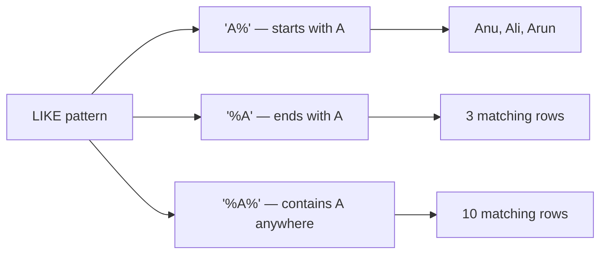

# Filtering, Aggregating, and Updating Data with SELECT and ALTER

## 1. What You'll Learn in This Section

In this lesson, you'll learn to:

- Retrieve specific columns and filter rows using `SELECT`, `WHERE`, and pattern-matching clauses
- Summarize data with aggregate functions (`AVG`, `SUM`, `COUNT`, `MIN`, `MAX`) and column aliases
- Modify a table's structure using `ALTER TABLE` (add, rename, drop columns)
- Update existing row data with `UPDATE` — including bulk updates that use `RAND()` and `FLOOR()`

---

## 2. Detailed Explanation

### SELECT with Column Projection

**Column projection** means choosing only the columns you need instead of fetching every column with `SELECT *`.

**Why it matters**

Real tables can have dozens of columns. Pulling only what you need keeps result sets clean and queries faster.

**Walkthrough**

List the column names right after `SELECT`, separated by commas:

```sql
SELECT name, salary FROM employees;
```

To retrieve a single column:

```sql
SELECT salary FROM employees;
```

To retrieve a different pair of columns:

```sql
SELECT employee_id, email FROM employees;
```

The database used throughout these examples is `DB1`. The `employees` table contains columns `employee_id`, `name`, `email`, and `salary`, with approximately 11 rows of sample data.

**Common mistakes**

- Using `SELECT *` when you only need one or two columns — it wastes bandwidth and makes output harder to read.
- Forgetting commas between column names, which causes a syntax error.

---

### Filtering Rows with WHERE and Comparison Operators

**Filtering** means telling SQL which rows to include in the result. The `WHERE` clause does this by applying a condition.

**Why it matters**

Without filtering, every row comes back. A table with millions of rows needs precise conditions to return useful results quickly.

**Walkthrough**

All standard comparison operators work inside `WHERE`:

| Operator | Meaning |
|----------|---------|
| `>` | Greater than |
| `>=` | Greater than or equal to |
| `<` | Less than |
| `<=` | Less than or equal to |
| `=` | Equal to |
| `!=` | Not equal to |

Retrieve employees earning more than $25,000:

```sql
SELECT name, salary FROM employees WHERE salary > 25000;
```

This returns five rows. Employees at or below $25,000 (such as Anu and Arun) are excluded.

Retrieve all columns for employees earning $35,000 or less:

```sql
SELECT * FROM employees WHERE salary <= 35000;
```

Exclude the employee earning exactly $29,000:

```sql
SELECT * FROM employees WHERE salary != 29000;
```

**Common mistakes**

- Using `=` to check "not equal" — always use `!=` for exclusion.
- Forgetting that string values need single quotes: `WHERE name = 'Anu'`, not `WHERE name = Anu`.

---

### Combining Conditions with AND and OR

`AND` and `OR` let you combine multiple conditions in a single `WHERE` clause.

**Why it matters**

Most real queries need more than one condition. Knowing when to use `AND` versus `OR` controls exactly which rows appear.

**Walkthrough**

- `AND` — both conditions must be true for a row to be included.
- `OR` — at least one condition must be true.

```sql
-- Both conditions must be true
SELECT * FROM employees WHERE salary > 25000 AND department_id > 5;

-- At least one condition must be true
SELECT * FROM employees WHERE salary < 20000 OR name = 'Anu';
```

In the `OR` example above, only one row is returned. The condition selects rows where salary is below $20,000 or the name is Anu. Only Anu satisfies one of those conditions in the sample data.

**Common mistakes**

- Confusing `AND` with `OR` — `AND` narrows results (fewer rows), `OR` widens them (more rows).
- Writing `WHERE salary > 20000 AND < 30000` — both sides of `AND` need a full condition: `WHERE salary > 20000 AND salary < 30000`.

---

### Range Filtering with BETWEEN

`BETWEEN` filters rows within an inclusive range — it includes both the lower and upper boundary values.

**Why it matters**

Writing `WHERE salary >= 25000 AND salary <= 30000` works, but `BETWEEN` is shorter and easier to read.

**Walkthrough**

```sql
SELECT * FROM employees WHERE salary BETWEEN 25000 AND 30000;
```

This returns multiple rows from the 11-row dataset — all employees whose salary falls at or between 25,000 and 30,000.

**Common mistakes**

- Forgetting that `BETWEEN` is inclusive on both ends. `BETWEEN 25000 AND 30000` includes employees earning exactly 25,000 and exactly 30,000.

---

### Matching a List of Values with IN

`IN` checks whether a column's value matches any item in a provided list.

**Why it matters**

Instead of chaining multiple `OR` conditions, `IN` lets you write one clean condition for a set of target values.

**Walkthrough**

```sql
SELECT * FROM employees WHERE name IN ('Raj', 'Kiran', 'David');
```

This returns three rows — one per matching name in the sample data. It is equivalent to:
`WHERE name = 'Raj' OR name = 'Kiran' OR name = 'David'`

**Common mistakes**

- Forgetting to wrap string values in single quotes inside the list.
- Using `IN` with a range of numbers — `IN` is for discrete values. Use `BETWEEN` for ranges.

---

### Pattern Matching with LIKE and %

`LIKE` filters text columns by pattern. The `%` symbol is the **wildcard** — it matches any sequence of characters (including zero characters).

**Why it matters**

You often know part of a value but not all of it. `LIKE` lets you search for partial matches without knowing the exact text.

**Walkthrough**

Three wildcard positions cover the most common patterns:

```sql
-- Names starting with A
SELECT * FROM employees WHERE name LIKE 'A%';
-- Returns: Anu, Ali, Arun

-- Names ending with A
SELECT * FROM employees WHERE name LIKE '%A';
-- Returns 3 rows

-- Names containing A anywhere
SELECT * FROM employees WHERE name LIKE '%A%';
-- Returns 10 rows (all except the one name with no letter A)
```



**Common mistakes**

- Forgetting which side the `%` goes on. `'A%'` catches the start; `'%A'` catches the end; `'%A%'` catches anywhere.
- Using `=` instead of `LIKE` for pattern matching — `=` requires an exact match.

---

### Removing Duplicates with SELECT DISTINCT

**`DISTINCT`** eliminates duplicate values from the result set. Place it right after `SELECT`.

**Why it matters**

When a column can hold repeated values, `DISTINCT` ensures each unique value appears only once — giving you a clean list.

**Walkthrough**

```sql
SELECT DISTINCT department_name FROM department;
```

If every department in the `department` table is already unique, this returns all rows. If a duplicate department were inserted, `DISTINCT` would collapse the duplicates so each department appears only once.

**Common mistakes**

- Expecting `DISTINCT` to work on a subset of columns when multiple columns are selected — `DISTINCT` applies to the entire row combination, not just one column.

---

### Column Aliases with AS

The **`AS` keyword** creates an alias — a temporary display name for a column or expression in the query result. Aliases do not add or change any column in the table. The underlying data is untouched.

**Why it matters**

Computed expressions like `salary * 12` have no natural column name in the output. An alias gives the result a clear, readable label without changing the table.

**Walkthrough**

Compute annual salary by multiplying monthly salary by 12:

```sql
SELECT name, salary * 12 AS annual_salary FROM employees;
```

From the sample data:
- An employee earning 30,000/month shows annual_salary = 360,000
- An employee earning 22,000/month shows annual_salary = 264,000

Apply an alias to an aggregate function:

```sql
SELECT AVG(salary) AS average_salary FROM employees;
```

**Common mistakes**

- Thinking an alias permanently renames the column — it only affects that query's output. Run `SELECT salary FROM employees` again and the column name is still `salary`.

---

### Aggregate Functions: AVG, SUM, COUNT, MIN, MAX

**Aggregate functions** compute a single summary value across multiple rows instead of returning one row per record.

**Why it matters**

Business questions like "What is the average salary?" or "How many employees do we have?" need a single-number answer derived from all rows. Aggregate functions produce those answers.

**Walkthrough**

| Function | Purpose |
|----------|---------|
| `AVG(column)` | Average of all values |
| `SUM(column)` | Total sum of all values |
| `COUNT(*)` | Number of rows |
| `MIN(column)` | Lowest value |
| `MAX(column)` | Highest value |

All five aggregates can run in a single query:

```sql
SELECT
    AVG(salary)   AS average_salary,
    SUM(salary)   AS total_salary,
    COUNT(*)      AS total_employees,
    MIN(salary)   AS lowest_salary,
    MAX(salary)   AS highest_salary
FROM employees;
```

Results from the 11-employee sample dataset:
- Average salary: approximately 25,454.55
- Total salary: approximately 280,000
- Total employees: 11
- Lowest salary: 21,000
- Highest salary: 30,000

**Combining aggregates with WHERE**

A `WHERE` clause filters rows before the aggregate calculates its result:

```sql
SELECT AVG(salary) AS average_salary FROM employees WHERE salary > 25000;
```

This returns approximately 28,000 — only salaries above $25,000 are included, so the average rises.

**SELECT never modifies data.** Running any `SELECT` — including one with aggregates or computed columns — only retrieves data. No column is added to the table, and no value changes. Use `ALTER TABLE` or `UPDATE` to make structural or data changes.

**Common mistakes**

- Using `AVG` on a column that contains `NULL` values without understanding that `NULL` rows are excluded from the average automatically.
- Forgetting to pair an alias with the result of an aggregate — the output column name becomes something like `AVG(salary)`, which is hard to reference.

---

### Modifying Table Structure with ALTER TABLE

**`ALTER TABLE`** changes the schema (structure) of an existing table. It can add new columns, rename or retype existing columns, and delete columns permanently.

**Why it matters**

Requirements change. A table designed last month may need a new column today. `ALTER TABLE` lets you evolve the structure without recreating the table from scratch.

**Walkthrough**

**Add a single column:**

```sql
ALTER TABLE employees ADD department_id INT;
```

After this, the `employees` table gains a `department_id` column. Existing rows receive `NULL` for this column until values are inserted.

**Add multiple columns at once:**

```sql
ALTER TABLE employees
    ADD city VARCHAR(50),
    ADD date_of_birth DATE;
```

**Rename a column and change its data type with CHANGE:**

```sql
ALTER TABLE employees CHANGE department_id department VARCHAR(50);
```

This renames `department_id` (previously `INT`) to `department` with type `VARCHAR(50)`.

**Drop a column permanently:**

```sql
ALTER TABLE employees DROP COLUMN age;
```

**Common mistakes**

- Dropping a column without realising the action is permanent — there is no built-in undo.
- Forgetting the new name and data type when using `CHANGE` — both are required even if only one is changing.

---

### Updating Existing Row Data with UPDATE

The **`UPDATE`** statement modifies existing data in a table. The `SET` keyword specifies which column to change and to what value. The `WHERE` clause limits which rows are affected.

**Why it matters**

Data changes over time — an employee moves to a new city, gets a raise, or joins a department. `UPDATE` makes those changes without deleting and re-inserting rows.

**Walkthrough**

**Update one column for one row:**

```sql
UPDATE employees SET salary = 50000 WHERE employee_id = 1;
```

**Update multiple columns at once:**

```sql
UPDATE employees SET department_id = 5, city = 'Mumbai' WHERE employee_id = 1;
```

**Bulk update using a computed expression:**

```sql
UPDATE employees
SET department_id = FLOOR(RAND() * 10) + 1
WHERE employee_id > 0;
```

This assigns a random integer between 1 and 10 to every employee's `department_id`. The condition `WHERE employee_id > 0` matches all rows because all employee IDs are positive. Omitting a `WHERE` clause on an `UPDATE` causes an error in some MySQL configurations.

**Common mistakes**

- Forgetting the `WHERE` clause when you only intend to update one row — without it, every row in the table changes.
- Updating the wrong column name — double-check the exact column name before running.

---

### RAND() and FLOOR() for Random Integer Generation

**`RAND()`** generates a random decimal number between 0 and 1 (exclusive of 1). **`FLOOR()`** converts a decimal to the nearest integer by rounding down.

**Why it matters**

Together, these two functions let you populate columns with random integers within any range — useful for seeding test data or assigning items randomly.

**Walkthrough**

The formula to generate a random integer from 1 to 10:

```sql
FLOOR(RAND() * 10) + 1
```

Step-by-step with an example value of 0.74:

1. `RAND()` produces a decimal in [0, 1) — for example, 0.74.
2. `RAND() * 10` expands the range to [0, 10) — for example, 7.4.
3. `FLOOR(RAND() * 10)` floors to an integer in {0, 1, 2, …, 9} — for example, 7.
4. Adding 1 shifts the range to {1, 2, 3, …, 10} — for example, 8.

No value reaches 11 because `RAND()` never returns exactly 1.0. The maximum value before `FLOOR` is just below 10.0, which floors to 9, and 9 + 1 = 10.

**Common mistakes**

- Forgetting the `+ 1` at the end — without it, the range is 0–9 instead of 1–10.
- Using `ROUND()` instead of `FLOOR()` — `ROUND()` can return 10 (rounding 9.5 up), which would make 11 reachable.

---

## 3. Key Takeaways

- Use column projection (`SELECT col1, col2`) to fetch only what you need, and `WHERE` with comparison operators (`>`, `<`, `=`, `!=`, `BETWEEN`, `IN`) to narrow which rows come back.
- `LIKE` with the `%` wildcard handles partial text matches; `DISTINCT` removes duplicate values from results.
- `AS` gives computed expressions a readable name in query output — it does not change the underlying table.
- Aggregate functions (`AVG`, `SUM`, `COUNT`, `MIN`, `MAX`) collapse multiple rows into a single summary value. Pair them with `WHERE` to aggregate only the rows you care about.
- `ALTER TABLE` changes table structure (add, rename, drop columns); structural changes like `DROP COLUMN` are permanent.
- `UPDATE … SET … WHERE` changes existing row values — always use a precise `WHERE` clause to avoid updating every row.
- `FLOOR(RAND() * N) + 1` is the standard SQL pattern for generating a random integer between 1 and N.

**Mental model:** Think of a SQL query as a funnel — `FROM` loads the full table, `WHERE` narrows the rows, column projection picks the columns, and aggregate functions distill everything into summary numbers. `ALTER TABLE` and `UPDATE` live outside the funnel; they reach into the table itself and change its shape or data.