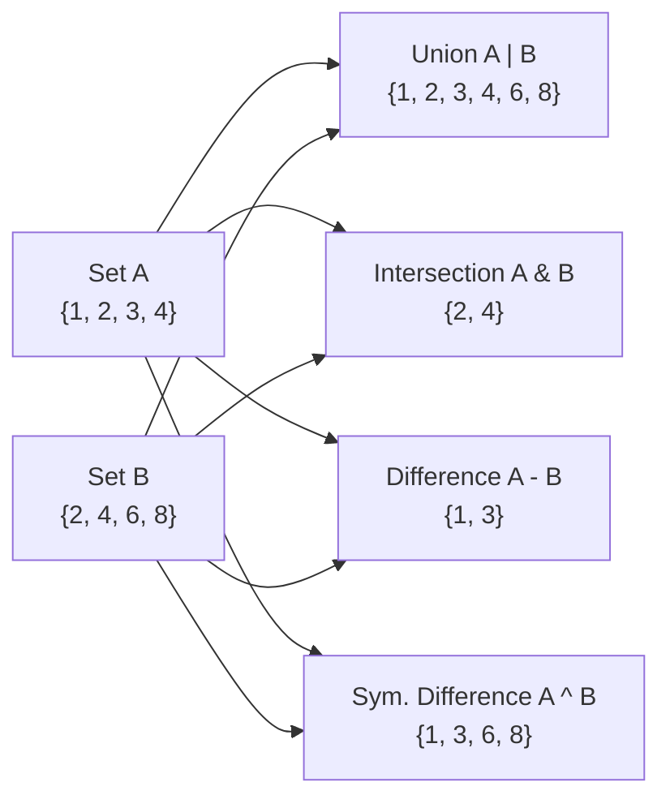

# Python Data Structures: Lists, Dictionaries, and Sets


## PPT Link: [Session 6](https://coding-platform.s3.amazonaws.com/dev/lms/tickets/74e16839-6f3d-48cb-a594-46e20bf67510/i0cFGlnlVSDWZydH.pdf)


## Collab Practice Code: [Collab Practice](https://coding-platform.s3.amazonaws.com/dev/lms/tickets/daa0fc28-5e9a-428b-8b08-18294d3f23a3/c00BvAUkCFvATRQK.ipynb)


## 1. What You'll Learn in This Section

In this lesson, you'll learn to:

- Explain why individual variables fail at scale and how data structures solve that problem
- Build and manipulate Python **lists** using indexing, slicing, and built-in methods
- Create and query Python **dictionaries** using key-value pairs and dictionary methods
- Apply Python **sets** to enforce uniqueness and mathematical operations, and choose the right data structure for any situation

## 2. Detailed Explanation

### Why data structures are necessary

Storing data in individual variables works fine for tiny amounts of information. But imagine a class of 100 students — you would need 100 separate variables just for their names. With 500,000 records, the approach becomes completely impossible.

**Why it matters**

A data structure lets a single variable hold any number of elements and retrieve them efficiently. Without them, programs cannot handle real-world data volumes — whether that is movie records, music libraries, sensor readings, or API responses.

**Walkthrough**

Think of a warehouse. If items are randomly scattered on the floor, finding anything takes forever. But if items sit on labeled shelves inside named cabinets, a medicine shop assistant can locate any drug in seconds because the inventory is organized.

A variable is like a single post-it note — it holds exactly one value. A data structure is like a whole filing cabinet — it holds many items, organized so any one of them can be retrieved on demand.

Python provides three primary built-in collection types:

| Structure | Characteristic |
|-----------|----------------|
| List | Ordered collection; position matters |
| Dictionary | Labeled collection; items retrieved by a user-defined key |
| Set | Unordered collection of unique elements; duplicates automatically removed |

**Common mistakes**

- Trying to store all items in separate variables — this breaks the moment data grows beyond a handful of items.
- Choosing a structure without thinking about what kind of retrieval you need (position vs. label vs. uniqueness).

---

### Lists — ordering and indexing

A **list** is a collection of items where order matters. The first item placed in the list is always at the first position, the second at the second, and so on. Think of a railway ticket queue: the person who joins first is always at position 1.

**Why it matters**

Order lets you reason about sequences — exam scores over time, frames in a video, a series of sensor measurements. Without a positional structure, you cannot say "give me the third result."

**Walkthrough**

Every position in a list has a numeric **index** starting at 0. The first element is at index 0, the second at index 1, and so on. This mirrors how European buildings number floors: the ground floor is floor 0, the next floor up is floor 1.

```python
fruits = ["apple", "banana", "cherry"]
print(fruits[0])   # apple  — first element
print(fruits[2])   # cherry — third element
```

Accessing an index that does not exist raises a `list index out of range` error.

A list is written with square brackets and items separated by commas. Lists can hold mixed types — integers, strings, floats, even complex numbers — all in the same list:

```python
scores = [10, 20, 30, 40, 30]          # homogeneous
x = [10, "Engineer", 4.5, 2+5j, 50]   # heterogeneous
```

**Common mistakes**

- Starting the count from 1 instead of 0 — remember, the first element is always at index 0.
- Accessing index `len(list)` — that index does not exist; the last valid index is always `len(list) - 1`.

---

### Creating lists and using len() and range()

You can create an empty list in two equivalent ways:

```python
x = list()   # using the list constructor
x = []       # using square-bracket literal
```

**Why it matters**

Starting from an empty list and adding items one at a time is a very common pattern when building up data programmatically — for example, collecting results from a loop.

**Walkthrough**

`len()` returns the number of elements in a list. Use it whenever you need to know how many items are stored:

```python
students = [0, 5, 10, 3, 7]
print(len(students))   # 5

x = [1, 2, 2, 99]
print(len(x))          # 4
```

`range(n)` generates a sequence of integers from 0 up to (but not including) `n`. Wrapping it in `list()` makes the sequence visible as a list:

```python
print(list(range(4)))    # [0, 1, 2, 3]
print(list(range(50)))   # [0, 1, 2, ..., 49]
```

`range()` is heavily used in machine learning and looping; the key fact is that the upper bound is always excluded.

**Common mistakes**

- Confusing `list()` (the constructor) with `[]` — both create empty lists, but `list()` can also convert other iterables like `range()` into a list.
- Expecting `range(n)` to include `n` — it stops one short.

---

### List concatenation and slicing

**List concatenation** joins two lists together using the `+` operator. This creates a new list containing all elements of both.

**Why it matters**

Concatenation lets you build larger lists from smaller pieces without writing complex loops — useful when combining datasets or adding a batch of results to an existing collection.

**Walkthrough**

```python
a = [1, 2, 3]
b = [4, 5, 6]
c = a + b         # [1, 2, 3, 4, 5, 6]

a += b            # equivalent to: a = a + b
```

Note that duplicate values across lists are kept — concatenation does not deduplicate.

**Slicing** extracts a sub-sequence from a list using the notation `list[start:end]`. The start index is included; the end index is excluded.

```python
t = [9, 4, 1, 12, 3, 7, 7000]

print(t[1:3])    # [4, 1]          — indices 1 and 2 (3 excluded)
print(t[:4])     # [9, 4, 1, 12]  — from beginning to index 3
print(t[3:])     # [12, 3, 7, 7000] — from index 3 to end
print(t[:])      # entire list — a full copy
```

**Common mistakes**

- Forgetting that the end index is excluded — `t[1:3]` gives index 1 and 2, not index 3.
- Expecting `t[:]` to modify the original — it only returns a copy.

---

### List methods

List **methods** are built-in operations you call on a list object using dot notation. They cover adding, removing, reordering, and searching elements.

**Why it matters**

Instead of rebuilding a list from scratch every time you need to add or remove an item, methods let you modify the list in place — cleanly and efficiently.

**Walkthrough**

| Method | What it does |
|--------|--------------|
| `append(item)` | Adds one item to the end |
| `insert(index, item)` | Inserts one item at the specified index |
| `extend(other_list)` | Appends all elements from another list |
| `remove(value)` | Removes the first occurrence of the specified value |
| `pop(index)` | Removes and returns the element at the specified index |
| `sort()` | Sorts elements in ascending order in place |
| `reverse()` | Reverses order in place |
| `index(value)` | Returns the index of the first occurrence of a value |
| `count(value)` | Returns how many times a value appears |

Key distinction: `remove()` takes an element **value** (e.g., `remove(40)`); `pop()` takes a numeric **index** (e.g., `pop(2)`).

```python
t = []
t.append(20)        # [20]
t.append(10)        # [20, 10]
t.append(40)        # [20, 10, 40]
t.append(30)        # [20, 10, 40, 30]

t.insert(0, 5)      # insert 5 at index 0 → [5, 20, 10, 40, 30]
t.remove(40)        # remove element 40 by value
t.pop(2)            # remove element at index 2

t.extend([5, 6, 9]) # add multiple items from another list
t.sort()            # sort ascending
t.reverse()         # reverse order
print(t.index(20))  # find the index of element 20
```

Here is a practical inventory example that combines several methods:

```python
items = ["tent", "boots", "flashlight", "compass"]
items.append("backpack")          # add at end
items.insert(1, "sleeping bag")   # insert at index 1
items.remove("flashlight")        # remove by name
items.pop(0)                      # remove first element (tent)

first_two = items[0:2]            # slicing → ["sleeping bag", "boots"]
```

**Common mistakes**

- Using `remove()` with an index instead of a value — `remove(2)` removes the element whose value is 2, not the element at position 2.
- Using `pop()` with a value instead of an index — `pop(40)` tries to remove the element at index 40, not the value 40.

---

### Dictionaries — key-value structure

A **dictionary** is a collection where each item consists of a key paired with a value. Keys act as a user-defined index; instead of locating a value by a numeric position, you locate it by a meaningful label.

Think of a mobile phone contact list: a contact stores a name and a phone number together. You look up the number by typing the name — the name is the key, the number is the value. An English dictionary works the same way: a word (key) maps to its definition (value).

**Why it matters**

When data has natural labels — a person's name, a product's field, a city's code — forcing it into numbered positions is awkward and error-prone. A dictionary lets you name each piece of data directly.

**Walkthrough**

A dictionary is written with curly braces `{}`. Keys and values are separated by a colon; pairs are separated by commas. Values can be of any type — strings, integers, floats, booleans, or even lists.

```python
user = {
    "name": "Analyst",
    "age": 25,
    "city": "New York"
}

print(user["name"])   # Analyst
print(user["age"])    # 25
```

Use the key inside square brackets to retrieve the corresponding value.

To add a new entry or update an existing one, assign to the key:

```python
user["year"] = 2000      # add new key
user["age"] = 30         # update existing key
user["color"] = "blue"   # add another new key
```

Create an empty dictionary with `{}` or `dict()`, then build it up:

```python
data = {}
data["name"] = "Developer"
data["age"] = 30
```

**Common mistakes**

- Using a numeric index (`user[0]`) on a dictionary — dictionaries do not have positional indexes; use the key name instead.
- Assuming a key exists before accessing it — accessing a missing key raises a `KeyError`.

---

### Dictionary methods and nested structures

Dictionary **methods** let you inspect all keys, values, or pairs at once, and merge one dictionary into another.

**Why it matters**

In data analytics and API work, you often need to loop over all fields in a record or combine two data sources. Dictionary methods make this straightforward.

**Walkthrough**

| Method | What it does |
|--------|--------------|
| `keys()` | Returns all keys in the dictionary |
| `values()` | Returns all values in the dictionary |
| `items()` | Returns all key-value pairs |
| `update(other_dict)` | Merges another dictionary into this one (existing keys are overwritten) |

```python
j = {"chart": 1, "fred": 42, "jar": 100}

print(j.keys())     # dict_keys(['chart', 'fred', 'jar'])
print(j.values())   # dict_values([1, 42, 100])
print(j.items())    # dict_items([('chart', 1), ('fred', 42), ('jar', 100)])
```

A dictionary value can itself be a list — this is useful for storing tagged data:

```python
product_catalog = {
    "name": "Mountain Explorer 10",
    "price": 250,
    "weight": 2.4,
    "waterproof": True,
    "tags": ["outdoor", "lightweight", "waterproof"]
}

product_catalog["price"] = 225    # update price
product_catalog["color"] = "red"  # add new field
print(product_catalog["name"])    # Mountain Explorer 10
```

A **list of dictionaries** is the natural way to store a collection of records. This is exactly the structure used in JSON data and modern web APIs:

```python
store_data = [
    {"item": "goods",  "price": 120, "stock": 10},
    {"item": "staple", "price": 225, "stock": 5}
]

print(store_data[0]["price"])   # 120 — first item's price
print(store_data[1]["price"])   # 225 — second item's price

goods_value = store_data[0]["price"] * store_data[0]["stock"]  # 1200
```

**Common mistakes**

- Forgetting that `update()` overwrites existing keys — if you merge two dictionaries that share a key, the merged value wins.
- Confusing `keys()` (which returns a view object) with a plain list — wrap with `list()` if you need a list: `list(j.keys())`.

---

### Sets — uniqueness and creation

A **set** is a collection of unique elements with no duplicates. It corresponds to the mathematical notion of a set. If you add an element that already exists, the second insertion is silently ignored. A set does not preserve insertion order.

Think of a set as a bag where every item is one-of-a-kind — if you try to put in a duplicate, it just disappears.

**Why it matters**

Deduplication is one of the most common data-cleaning tasks. Sets let you remove duplicates automatically without writing a loop or checking for membership manually.

**Walkthrough**

Sets can hold integers, floats, strings, and complex numbers. They cannot contain mutable or unhashable objects such as other lists, sets, or dictionaries.

There are three ways to create a set:

```python
# 1. Convert an existing list using set()
emails = ["a@a.com", "b@b.com", "a@a.com", "c@c.com", "b@b.com"]
unique_emails = set(emails)
# {'a@a.com', 'b@b.com', 'c@c.com'}

# 2. Curly-brace literal — duplicates are automatically removed
s = {1, 2, 3, 2, 1}
# {1, 2, 3}

# 3. Empty set, then add elements one by one
n_set = set()    # must use set(), NOT {} — bare {} makes an empty dict
n_set.add(1)
n_set.add(2)
n_set.add(20)
# {1, 2, 20}
```

**Set methods:**

| Method | What it does |
|--------|--------------|
| `add(element)` | Adds a single element (no effect if already present) |
| `update(iterable)` | Adds all elements from an iterable |
| `remove(element)` | Removes an element; raises an error if not found |
| `discard(element)` | Removes an element; no error if not found |
| `clear()` | Removes all elements |

```python
n_set.update([9, 12])   # adds 9 and 12
n_set.add(1)            # 1 already in set — ignored
```

**Common mistakes**

- Writing `n_set = {}` to create an empty set — this actually creates an empty dictionary. Always use `set()` for an empty set.
- Expecting a set to preserve the order in which elements were added — sets are unordered.

---

### Set operations

**Set operations** let you combine or compare two sets in ways that mirror standard mathematical set theory. You can use method calls or operator symbols — both produce the same result.

**Why it matters**

Set operations are the cleanest way to answer questions like "which customers are in both groups?", "who is in one list but not the other?", or "what is the full combined list with no duplicates?"

**Walkthrough**



| Operation | Method | Operator | Meaning |
|-----------|--------|----------|---------|
| Union | `.union(B)` | `A \| B` | All elements from A and B; duplicates kept once |
| Intersection | `.intersection(B)` | `A & B` | Only elements present in both A and B |
| Difference | `.difference(B)` | `A - B` | Elements in A that are NOT in B |
| Symmetric difference | `.symmetric_difference(B)` | `A ^ B` | Elements in A or B but NOT in both |

```python
A = {1, 2, 3, 4}
B = {2, 4, 6, 8}

print(A | B)   # {1, 2, 3, 4, 6, 8}  — union
print(A & B)   # {2, 4}              — intersection
print(A - B)   # {1, 3}              — difference
print(A ^ B)   # {1, 3, 6, 8}        — symmetric difference
```

Here is a practical example with newsletter subscribers and new leads:

```python
newsletter_subscribers = {"dev@red.com", "eng@blue.com", "ops@take.com"}
new_leads = {"eng@blue.com", "analyst@new.com", "ops@take.com"}

newsletter_subscribers.discard("ops@take.com")   # remove one subscriber

# Find leads who are already subscribers
already_subscribed = newsletter_subscribers & new_leads

# Full mailing list — everyone in either group
full_mailing_list = newsletter_subscribers | new_leads
```

**Common mistakes**

- Confusing `A - B` (elements in A but not B) with `B - A` — order matters for difference.
- Expecting the symmetric difference to include shared elements — `A ^ B` deliberately excludes them.

---

### Choosing the right data structure

Knowing which structure to pick is just as important as knowing how to use each one.

**Why it matters**

Picking the wrong structure leads to awkward code — using a list when you need key-based lookup, or a dictionary when you only care about uniqueness. Getting the choice right makes the rest of the code simpler.

**Walkthrough**

| Feature | List | Dictionary | Set |
|---------|------|------------|-----|
| Syntax | `[item, item, ...]` | `{"key": value, ...}` | `{item, ...}` or `set()` |
| Ordering | Preserved | Key-based (not position-based) | Not preserved |
| Access | Numeric index (0, 1, 2, …) | User-defined key | No direct positional access |
| Duplicates | Allowed | Keys must be unique; values can repeat | Not allowed |
| Best used when | Order and position matter | Items have meaningful labels | Only unique elements are needed |

Use a **list** when order matters and items are accessed by position — student scores in an exam, frames in a video, a series of measurements.

Use a **dictionary** when items have meaningful labels and you want to look them up by name — a contact book (name → phone number), product records, machine learning dataset labels.

Use a **set** when only unique elements matter and duplicates must be discarded — deduplicating email lists, finding common subscribers across two mailing lists, applying mathematical set operations.

**Common mistakes**

- Using a list and writing manual loops to check for duplicates — a set handles this automatically.
- Using a list of tuples when a dictionary would give you direct key-based access without looping.

## 3. Key Takeaways

- A single variable cannot scale beyond a handful of items; data structures let one variable hold millions of organized, retrievable elements.
- **Lists** preserve order and use 0-based numeric indexes — use them when position matters and duplicates are expected.
- **Dictionaries** map user-defined keys to values — use them when data has natural labels you want to look up directly, as in JSON records and API responses.
- **Sets** automatically enforce uniqueness and support union, intersection, difference, and symmetric-difference operations — use them for deduplication and membership comparisons.
- When choosing a structure, ask three questions: Does order matter? Do items need labels? Must duplicates be removed?

**Mental model:** Think of a list as a numbered queue, a dictionary as a labeled filing cabinet, and a set as a bag where every item is guaranteed to be one-of-a-kind.