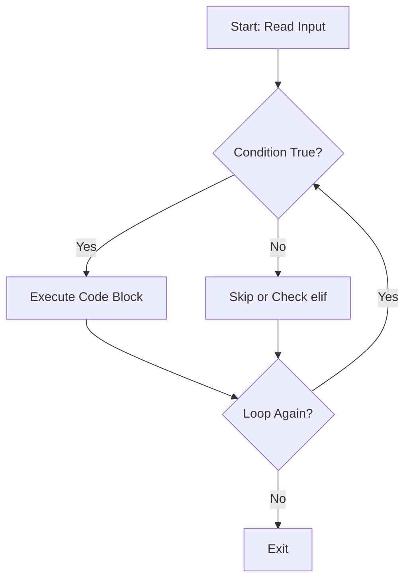

# Python Logic and Control Flow

## PPT Link: [Session 7](https://coding-platform.s3.amazonaws.com/dev/lms/tickets/7e345f89-cb44-4105-bd9a-af1bf66a959a/JEiDyjcUYThQxKPw.pdf)


## Collab Practice Code: [Collab Practice](https://coding-platform.s3.amazonaws.com/dev/lms/tickets/c12c5687-6eb5-4088-95c6-f5628e954c5b/YeXlRVgkbgLNF1yO.ipynb)


## 1. What You'll Learn in This Section

In this lesson, you'll learn to:

- Build decision-making logic using conditional statements (if, else, elif) to control what code runs
- Apply comparison and logical operators to evaluate conditions that determine program flow
- Automate repetitive tasks using while and for loops
- Use loop control statements to skip iterations, exit loops, and manage program logic

## 2. Detailed Explanation

### Boolean Values and Comparison Operators

A **Boolean value** is one of two keywords in Python: `True` or `False`. Think of them as on/off switches that control what your program does next.

**Why it matters**

Every decision in a program comes down to True or False. When you check if a user's age is over 18, or if a password is correct, you're evaluating a Boolean expression. These are the foundation of decision-making in code.

**Walkthrough**

Python provides **comparison operators** that compare two values and return True or False:

| Operator | Meaning | Example | Result |
|----------|---------|---------|--------|
| `==` | Equals | `5 == 5` | True |
| `!=` | Not equal | `5 != 3` | True |
| `>` | Greater than | `10 > 8` | True |
| `<` | Less than | `3 < 7` | True |
| `>=` | Greater than or equal | `10 >= 10` | True |
| `<=` | Less than or equal | `5 <= 6` | True |
| `%` | Modulo (remainder) | `10 % 3` | 1 |

Here's a key distinction: a single `=` assigns a value to a variable, while `==` compares two values.

```python
age = 20              # assignment: store 20 in age
if age == 20:         # comparison: check if age is 20
    print("You are 20")
```

When comparing strings, Python is case-sensitive. `"admin"` and `"Admin"` are different:

```python
username = "admin"
if username == "admin":    # True
    print("Access granted")
if username == "Admin":    # False
    print("This won't print")
```

**Common mistakes**

- Using `=` instead of `==` in conditions. The single equals sign assigns rather than compares. Python will error or behave unexpectedly.
- Forgetting that string comparisons are case-sensitive. Always check the exact capitalization your data uses.

### Logical Operators

A **logical operator** combines multiple conditions into one. When you need to check if _all_ conditions are true, or if _at least one_ is true, logical operators do the job.

**Why it matters**

Real-world decisions rarely hinge on a single condition. A bank approves a loan if the customer has a good credit score _and_ sufficient income. A delivery service skips a house if it's closed _or_ has no valid address. Logical operators handle these multi-condition scenarios.

**Walkthrough**

Python has three logical operators:

- **and**: Returns True only if ALL conditions are true
- **or**: Returns True if AT LEAST ONE condition is true
- **not**: Reverses a Boolean value (True becomes False, and vice versa)

Here's a truth table showing how `and` and `or` behave:

| Condition A | Condition B | A and B | A or B |
|-------------|-------------|---------|--------|
| True        | True        | True    | True   |
| True        | False       | False   | True   |
| False       | True        | False   | True   |
| False       | False       | False   | False  |

Using `and`:

```python
credit_score = 720
annual_income = 45000
if credit_score > 700 and annual_income >= 45000:
    print("Eligible for premium account")
```

Both conditions must be true. If either is false, the block doesn't run.

Using `or`:

```python
user_role = "admin"
has_special_access = False
if user_role == "admin" or has_special_access:
    print("Access granted")
```

At least one condition is true, so the message prints.

Using `not`:

```python
is_closed = False
if not is_closed:
    print("Store is open")
```

The `not` operator flips the Boolean.

**Common mistakes**

- Mixing `and` and `or` without parentheses. When you combine them, use parentheses to make your intent clear.
- For example, `if (age > 18 and income > 30000) or has_savings:` is much clearer than omitting parentheses.
- Forgetting that `or` requires only ONE true condition, not all. This catches many beginners.

### Conditional Statements: if, else, and elif

An **if statement** executes a block of code only if a condition is true. When you want to handle multiple paths, use `else` and `elif` to branch the logic.

**Why it matters**

Conditional statements let your program make decisions. Without them, your code runs the same way every time. With them, your program responds differently based on data—approving or rejecting a user, applying different prices, displaying different messages.

**Walkthrough**

The simplest form is the `if` statement:

```python
age = 20
if age >= 18:
    print("You are allowed to enter")
```

Notice the colon (`:`) after the condition—it's required. All statements inside the `if` block must be indented.

When you need two paths—one if the condition is true, one if it's false—use `if-else`:

```python
percentage = 50
if percentage > 33:
    print("Pass")
else:
    print("Fail")
```

When there are more than two paths, use `elif` (else if) to check additional conditions:

```python
score = 85
if score >= 90:
    grade = 'A'
elif score >= 80:
    grade = 'B'
elif score >= 70:
    grade = 'C'
else:
    grade = 'F'
print(grade)
```

Python evaluates conditions top to bottom and executes only the first block where the condition is true. With `score = 85`, it skips the 90 check, finds 80 is true, assigns `grade = 'B'`, and stops.

**Common mistakes**

- Forgetting the colon after the condition. Python requires it.
- Incorrect indentation. All statements inside an `if` block must be indented consistently. Inconsistent indentation causes errors.
- Using `if` for every branch instead of `elif`. Multiple `if` statements check every condition, wasting time. Use `elif` to stop after the first match.

### Nested Conditional Statements and Complex Logic

A **nested if** is an `if` statement inside another `if` statement. This handles complex decision-making that requires multiple screening levels.

**Why it matters**

Some decisions have layers. A bank checks if a customer has sufficient funds _before_ verifying their identity; the identity check only runs if funds are confirmed. Nested structures mirror real-world logic gates and prevent unnecessary computation.

**Walkthrough**

Here's a nested if structure:

```python
color = "red"
item = "fruit"
if color == "red":
    if item == "fruit":
        print("It is an apple")
    else:
        print("It is a tomato")
else:
    print("Not red")
```

The inner `if` only runs if the outer condition is true.

You can also combine conditions with logical operators instead of nesting:

```python
credit_score = 720
annual_income = 45000
if credit_score > 700 and annual_income >= 45000:
    print("Eligible for premium account")
```

Both approaches work; combining with logical operators is often cleaner.

**Common mistakes**

- Over-nesting. Deep nesting becomes hard to follow. Consider using logical operators (`and`, `or`) to flatten the structure.
- Mixing nested ifs with logical operators without parentheses. Always use parentheses in complex conditions: `if (a and b) or c:` is clearer.

### while Loops: Repeating Until a Condition Changes

A **while loop** repeats a block of code as long as a condition is true. When the condition becomes false, the loop exits.

**Why it matters**

Many tasks require repetition: draining a phone battery, processing logs until an error, or counting down. `while` loops automate these repetitive actions without writing the same code multiple times.

**Walkthrough**

Here's a `while` loop:

```python
battery = 10
while battery > 0:
    print("Phone is on")
    battery -= 2
```

The condition is checked before each iteration. The loop executes as long as `battery > 0`. After each iteration, the loop returns to check the condition. When battery becomes 0 or less, the loop exits.

A critical rule: the condition must eventually become false, or the loop runs infinitely.

```python
number = 1
while number < 1000:
    print(number)
    number = number * 2
```

This prints 1, 2, 4, 8, 16, 32, 64, 128, 256, 512. The next value would be 1024 (not less than 1000), so the loop stops.

**Common mistakes**

- Forgetting to update the condition variable inside the loop. If `battery` never changes, the loop never exits (infinite loop).
- Using the wrong comparison operator. `while battery >= 0:` includes 0; `while battery > 0:` stops at 0.

### for Loops: Iterating Over Collections

A **for loop** iterates over each item in a collection (list, tuple, or range). The loop variable takes on each value one at a time.

**Why it matters**

When you have a known collection of items, `for` loops are cleaner and safer than `while`. They automatically handle iteration, and you can't accidentally create an infinite loop.

**Walkthrough**

Iterate over a list:

```python
prices = [10, 20, 30, 45]
for p in prices:
    print(p * 1.2)
```

The variable `p` takes on each value from `prices` in order. This prints each price with a 20% markup.

The `range()` function generates a sequence of numbers:

```python
for i in range(1, 10):
    print(i)
```

This prints 1 through 9. `range(start, end)` produces integers from `start` up to (but not including) `end`.

Combine a `for` loop with an `if` to filter items:

```python
prices = [10, 20, 30, 45, 50]
for p in prices:
    if p > 30:
        print(p * 1.2)
```

Only prices greater than 30 are processed.

Nested loops repeat the inner loop for every iteration of the outer loop:

```python
cities = ["Jaipur", "Delhi", "Mumbai"]
fruits = ["Apple", "Mango", "Cherry"]
for city in cities:
    for fruit in fruits:
        print(f"{city} - {fruit}")
```

For each city, all fruits are printed, creating all combinations.

**Common mistakes**

- Forgetting that `range(start, end)` excludes the end value. `range(1, 10)` gives 1–9, not 1–10.
- Modifying a list while iterating over it. This can skip items or cause errors.

### Loop Control Statements: pass, break, and continue

Loop control statements let you fine-tune how a loop behaves. **pass** does nothing, **break** stops the loop, and **continue** skips to the next iteration.

**Why it matters**

Loop control statements give you precise command. Without them, loops always run to completion. With them, you can exit early on an error, skip invalid items, or hold a placeholder for future code.

**Walkthrough**

The **pass** statement is a placeholder. Use it when syntax requires a block but you don't need code yet:

```python
a = 6
b = 0
if b == 0:
    pass
else:
    print(a / b)
```

The **break** statement terminates a loop immediately:

```python
fruits = ["Apple", "Banana", "Cherry"]
for fruit in fruits:
    if fruit == "Banana":
        break
    print(fruit)
```

This prints "Apple" and stops. "Cherry" is never printed.

The **continue** statement skips the current iteration and jumps to the next:

```python
fruits = ["Apple", "Banana", "Cherry"]
for fruit in fruits:
    if fruit == "Banana":
        continue
    print(fruit)
```

This prints "Apple" and "Cherry" but skips "Banana".

Here's the hierarchy:

- **pass**: Does nothing; used as a placeholder
- **continue**: Skips the current iteration; loop continues with the next item
- **break**: Terminates the entire loop; no more iterations occur

A practical example:

```python
logs = ["info", "warning", "error", "fatal", "critical"]
for log in logs:
    if "fatal" in log:
        print("Critical error found - stopping")
        break
    print(f"Processing: {log}")
```

This processes logs until "fatal" is found, then exits.

**Common mistakes**

- Using `break` when `continue` is intended (or vice versa). `break` exits the loop; `continue` moves to the next item.
- Using `pass` in production code where actual logic should go. `pass` is only a placeholder.

### User Input with input()

The **input()** function prompts the user to type something. The user's response is stored as a string.

**Why it matters**

Most programs need to respond to users. Games ask for a player's move. Banking apps ask for a PIN. Input lets your program read what the user types and act on it.

**Walkthrough**

```python
age = input("Enter your age: ")
if int(age) >= 18:
    print("You can enter")
```

`input()` returns a string, so you must convert it to a number with `int()` before comparing numerically. Skipping this conversion causes type errors.

**Common mistakes**

- Forgetting to convert `input()` output. `input()` always returns a string. Use `int()` for numbers, `float()` for decimals.
- Not validating user input. Users may type invalid data. Consider adding error handling.

### Flow Control Visualization

Below is a mermaid diagram showing how conditional statements and loops work together:



This diagram illustrates how a program evaluates conditions, executes blocks, and decides whether to loop or exit.

## 3. Key Takeaways

- **Boolean logic** forms the foundation: comparison operators evaluate conditions; logical operators (`and`, `or`, `not`) combine them.
- **Conditional statements** (if, else, elif) let your program choose different paths based on conditions.
- **while loops** repeat as long as a condition is true; **for loops** iterate over known collections.
- **Loop control** (break, continue, pass) gives precise command: break exits, continue skips, pass is a placeholder.
- **Indentation** is mandatory in Python—it defines which statements belong to a block (if, else, loop, etc.).

**Mental model:** Think of conditional statements and loops as traffic signals. Conditionals are red/green lights that decide which direction you go; loops are ramps that repeat the path until you reach your exit.ed