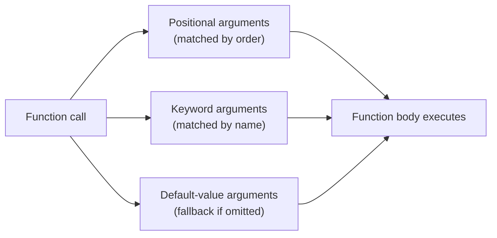

# Functions and Modules in Python

## PPT Link: [Session 8](https://coding-platform.s3.amazonaws.com/dev/lms/tickets/e7d8257c-85fe-4f85-9e3e-d93fa5f0169a/DSpMcgqmYEpVkHxY.pdf)


## Collab Practice Code: [PY_Session_8](https://coding-platform.s3.amazonaws.com/dev/lms/tickets/f09307d3-ba57-495a-a5d0-b09c9dd7f8d4/blVDu3AOZvYMVcRe.ipynb)


## 1. What You'll Learn in This Section

In this lesson, you'll learn to:

- Define and call your own functions in Python using the `def` keyword.
- Apply positional, keyword, and default-value arguments to control how data flows into a function.
- Distinguish between local and global variables to avoid scope-related bugs.
- Import and use Python's built-in modules (`math`, `statistics`, `datetime`) and create your own custom modules.

---

## 2. Detailed Explanation

### The DRY principle — why functions and modules exist

**DRY** stands for "Don't Repeat Yourself." It is the design principle that motivates using functions and modules in Python.

**Why it matters**

Imagine calculating a selling price with 5% tax for 100 items, then 250 items, then 400 items. Without a function, you write the same multiplication three separate times. Each repetition is a new place where a typo can sneak in. If the tax rate ever changes, you must hunt down and fix every line individually.

**Walkthrough**

Without a function, the repeated code looks like this:

```python
sales1 = 100 * 1.05
sales2 = 250 * 1.05
sales3 = 400 * 1.05
```

The DRY approach says: write the logic once, call it as many times as needed. Functions solve the repetition problem for logic inside one file. Modules extend the same idea to whole files — a `.py` file containing many functions can be imported by any other program, so the logic never needs to be rewritten.

**Common mistakes**

- Copying and pasting code instead of extracting a function — when the logic changes, you have to update every copy separately.
- Forgetting that modules follow the same DRY principle — if a group of functions is useful in more than one script, they belong in their own module file.

---

### What a function is

A **function** is a named, reusable block of code that takes inputs (called **arguments** or **parameters**), carries out some processing, and optionally produces an **output** (the return value). Think of a function like a kitchen recipe: the ingredients are the arguments, the recipe steps are the processing, and the finished dish is what the function gives back.

**Why it matters**

Functions let a developer name a piece of logic and invoke it by name from anywhere in the program. This makes code shorter, easier to read, and much simpler to test — once a function works correctly, it can be reused everywhere without re-debugging.

**Walkthrough**

Python provides two categories of functions:

- **Built-in functions** — already available in Python, no definition required. Examples: `print()`, `type()`, `int()`, `float()`, `str()`, `len()`, `abs()`, `sorted()`.
- **User-defined functions** — created by the programmer using the `def` keyword, for logic specific to the application.

Here is the general shape of a function definition:

```python
def function_name(parameter1, parameter2):
    # function body
    result = parameter1 + parameter2
    return result
```

Key parts to notice:
- `def` keyword — signals the start of a function definition.
- **Function name** — any valid identifier; do not reuse reserved names like `print` or `type`.
- **Parameters** — placeholders inside the parentheses; there can be zero, one, or many.
- **Indentation** — everything indented under `def` belongs to the function body.
- `return` statement — sends a value back to the caller (optional).

**Common mistakes**

- Using a reserved keyword as a function name (e.g., naming your function `print`) — Python will accept it but silently overwrite the built-in, causing hard-to-spot bugs.
- Forgetting to indent the function body — Python raises an `IndentationError` immediately.

---

### Defining and calling functions — worked examples

Seeing functions in real scenarios is the fastest way to make the syntax stick.

**Why it matters**

A function is only useful when you call it. Understanding how a call maps values to parameters — and how the return value travels back — is the foundation for everything else.

**Walkthrough**

**Tax calculation (one parameter)**

```python
def apply_tax(amount):
    return amount * 1.05

tax1 = apply_tax(100)   # returns 105.0
tax2 = apply_tax(250)   # returns 262.5
tax3 = apply_tax(400)   # returns 420.0
```

`amount` is a placeholder. When you write `apply_tax(100)`, Python replaces `amount` with `100` inside the body.

**Area of a circle (one parameter, uses a formula)**

```python
def calculate_area(radius):
    area = 3.14 * radius ** 2
    return area

a1 = calculate_area(5)     # returns 78.5
a2 = calculate_area(5.02)  # returns approximately 79.13
```

**Greeting with two parameters**

```python
def greet_user(name, num_friends):
    print(f"Hello {name} has {num_friends} friends")

greet_user("Bob", 5)  # prints: Hello Bob has 5 friends
```

Both parameters must be supplied; passing only one raises an error.

**Function called inside a loop**

```python
def simple_function(message):
    print(f"I eat {message}")
    print(f"I eat {message.upper()}")

fruits = ["apple", "banana", "cherry"]
for x in fruits:
    simple_function(x)
```

Each item in `fruits` is passed as `message`. The function body runs twice per fruit — once in the original case and once in uppercase.

**Growth rate with formatted output**

```python
def calculate_growth(initial, final):
    change = (final - initial) / initial * 100
    print(f"Growth rate: {change:.2f}%")

calculate_growth(5000, 6500)  # prints: Growth rate: 30.00%
calculate_growth(6000, 6500)  # prints: Growth rate: 8.33%
```

The format specifier `:.2f` limits the decimal output to two places. Without it, Python would print many decimal digits.

**Common mistakes**

- Calling a function before defining it — Python reads files top to bottom; the `def` block must appear before the call.
- Forgetting parentheses when calling — writing `apply_tax` without `()` gives you a reference to the function object, not the result.

---

### Three ways to pass arguments



Python gives you three styles for passing data into a function, and you can choose whichever fits the situation.

**Why it matters**

Different calling styles make code clearer and more flexible. Positional arguments are concise; keyword arguments are self-documenting; default values reduce the number of arguments a caller must supply for the common case.

**Walkthrough**

**1. Positional arguments** — arguments are matched to parameters by position. The first argument maps to the first parameter, the second to the second, and so on.

```python
def greet_user(name, num_friends, xyz):
    print(f"Hello {name} has {num_friends} friends of {xyz} school")

greet_user("Bob", 5, "MIT")   # name=Bob, num_friends=5, xyz=MIT
greet_user("MIT", 5, "Bob")   # name=MIT, num_friends=5, xyz=Bob
```

Swapping the order changes which value fills which placeholder, so the output changes entirely.

**2. Keyword arguments** — the caller names each parameter explicitly. Order no longer matters.

```python
# Both calls below produce the same result
calculate_growth(final=6500, initial=5000)
greet_user(xyz="MIT", name="Bob", num_friends=5)
```

One rule: a positional argument must not follow a keyword argument in the same call. Python raises a `SyntaxError` if you break this rule.

**3. Default value arguments** — a parameter is given a fallback value in the function definition. If the caller omits that argument, the default is used; if the caller provides one, it overrides the default.

```python
def describe_pet(pet_name, animal_type="dog"):
    print(f"I have a {animal_type} named {pet_name}.")

describe_pet("Buddy")            # uses default: I have a dog named Buddy.
describe_pet("Whiskers", "cat")  # overrides: I have a cat named Whiskers.
describe_pet("Sly", "snake")     # overrides: I have a snake named Sly.
```

**Common mistakes**

- Reversing positional arguments — `greet_user(5, "Bob", "MIT")` puts `5` where `name` should be. Python does not check types; the wrong value just flows in silently.
- Placing default-value parameters before non-default parameters in the function signature — Python requires all parameters with defaults to come after those without defaults.

---

### Return values and void functions

A **void function** performs its work (usually printing) and stops without sending anything back. A function with a `return` statement sends a computed value back to the caller.

**Why it matters**

If you need the result of a calculation for a later step in the program, you must use `return`. Printing inside the function consumes the value immediately — it cannot be stored or used in the next calculation.

**Walkthrough**

```python
# Void — prints but returns nothing
def show_message():
    print("Hello World")

# Returns a value — caller can store and reuse it
def square_num(num):
    return num * num

result = square_num(10)       # result holds 100
final_sale = result * 1.05    # 100 is now used in the next step
```

Notice the difference: `show_message()` has no `return`, so calling it gives you `None` if you try to capture its output. `square_num(10)` returns `100`, which you can multiply further.

**Common mistakes**

- Using `print` inside a function when `return` is needed — the value disappears as soon as it is printed; subsequent code cannot access it.
- Forgetting that `return` exits the function immediately — any code written after `return` inside the same function will never run.

---

### Local and global variables

A **global variable** is defined in the main program body (outside any function) and is accessible both inside and outside functions. A **local variable** is defined inside a function and exists only while that function is running.

**Why it matters**

Understanding scope prevents confusing errors. A local variable defined inside one function is completely invisible to the rest of the program. Trying to read it from outside raises a `NameError`.

**Walkthrough**

```python
x = 10  # global variable

def my_function():
    local_var = "I am local"  # local variable
    print(x)                  # global — accessible inside the function

my_function()
print(x)          # prints 10 — global is accessible anywhere
print(local_var)  # NameError — local_var does not exist here
```

Think of a local variable like a school that exists only in one city. Outside that city (outside the function), the school simply does not exist.

**Common mistakes**

- Assuming a variable created inside a function is available everywhere — it is not; it vanishes when the function returns.
- Accidentally relying on a global variable inside a function when you intended to pass it as a parameter — this makes the function harder to test and reuse.

---

### What a module is and how to import one

A **module** is a Python file (any `.py` file) that contains functions, variables, or classes. Modules act as toolboxes: instead of rewriting the same functions in every program, you import the module and call its functions directly.

**Why it matters**

Python's popularity in data science and machine learning comes largely from its rich ecosystem of ready-made modules — covering statistics, mathematics, machine learning, data handling, and more. Knowing how to import them unlocks that ecosystem instantly.

**Walkthrough**

Python provides three import styles:

**1. Import the entire module**

```python
import math

result  = math.sqrt(144)      # returns 12.0
fact    = math.factorial(5)   # returns 120
gcd_val = math.gcd(144, 12)   # returns 12
```

After `import math`, every function in the module is available using the `math.` prefix.

**2. Import a specific item**

```python
from math import pi

print(pi)   # prints 3.141592653589793
```

Only `pi` is brought into the local namespace. Other `math` functions remain inaccessible by name. Use this style when you need just one or two items.

**3. Aliasing — giving a module a shorter nickname**

```python
import statistics as stats

data = [10, 20, 30]
print(stats.mean(data))    # prints 20
print(stats.median(data))  # prints 20
print(stats.mode(data))    # prints 10
```

The alias `stats` replaces the full module name everywhere. Common aliases you will encounter in data science work: `import pandas as pd`, `import numpy as np`, `import statistics as stats`.

**Common mistakes**

- Writing `import math.sqrt` — you import the module, not individual functions, with the bare `import` statement. Use `from math import sqrt` to import just the function.
- Forgetting the module prefix — after `import math`, calling `sqrt(144)` without the `math.` prefix raises a `NameError`.

---

### Standard library modules: math, statistics, and datetime

Python ships with a large collection of ready-to-use modules called the **standard library**. Three commonly used ones are demonstrated here.

**Why it matters**

These modules save you from reimplementing common calculations from scratch. They are also reliable and well-tested, which means fewer bugs in your programs.

**Walkthrough**

| Module | Example functions | What they do |
|---|---|---|
| `math` | `sqrt`, `factorial`, `gcd`, `floor`, `ceil`, `log` | Mathematical functions and the constant `pi` |
| `statistics` | `mean`, `median`, `mode`, `stdev`, `variance` | Descriptive statistics on a list of numbers |
| `datetime` | `datetime.now()` | Returns the current date and time |

**`math` module**

```python
import math

print(math.sqrt(144))       # 12.0
print(math.factorial(5))    # 120
print(math.gcd(144, 12))    # 12
print(math.pi)              # 3.141592653589793
```

**`statistics` module** (demonstrated with `[10, 20, 30]`):

```python
import statistics as stats

data = [10, 20, 30]
print(stats.mean(data))    # 20
print(stats.median(data))  # 20
print(stats.mode(data))    # 10
```

**`datetime` module** — useful for logging when a data record was collected:

```python
import datetime

print(datetime.datetime.now())   # current date and time
```

**Common mistakes**

- Confusing `statistics.mean` with a manual average calculation — the module function is correct and handles edge cases; prefer it over custom code.
- Calling `datetime.now()` directly without the second `datetime` — the class and the module share the name, so the correct call is `datetime.datetime.now()`.

---

### Creating your own module

Any `.py` file you write is a valid module. Organising related functions into a module file lets any other script import and use them without copying code.

**Why it matters**

As programs grow, a single long file becomes hard to navigate. Splitting logic into purpose-built module files keeps each file focused, and sharing the module across multiple programs requires zero duplication.

**Walkthrough**

**Step 1 — create the module file** (e.g., `my_file.py`):

```python
# my_file.py
def display_message(name):
    print(f"Hi {name}")

def double_number(x):
    print(x * 2)
```

**Step 2 — import and use it** in another script:

```python
import my_file

my_file.display_message("Alex")  # prints: Hi Alex
my_file.double_number(10)        # prints: 20
```

You can also apply aliasing and selective import to custom modules, exactly as with standard library modules:

```python
import my_file as mf
mf.display_message("Alex")

from my_file import display_message
display_message("Alex")
```

In a Jupyter-style environment such as Google Colab, use the `%%writefile` magic command to create the module file directly from a notebook cell:

```python
%%writefile my_file.py
def display_message(name):
    print(f"Hi {name}")

def double_number(x):
    print(x * 2)
```

Note: when you edit a module file in a notebook environment, the kernel may cache the old version. The updated module may not take effect until you restart the session.

**Common mistakes**

- Including the `.py` extension in the import statement — write `import my_file`, not `import my_file.py`.
- Editing the module file in a notebook and expecting the change to appear immediately — restart the kernel to pick up the updated version.

---

### Benefits of functions and modules

**Why it matters**

Understanding the benefits helps you decide when to extract a function or create a module — and persuades your team to follow the same practice.

**Walkthrough**

Four key benefits:

1. **Reusability** — write the logic once, use it many times; no need to rewrite the same code from scratch.
2. **Bug-free base** — once a function is tested and confirmed correct, it can be reused everywhere without re-debugging.
3. **Maintainability** — updating a single function or module automatically fixes the behaviour across the entire program.
4. **Clarity and collaboration** — breaking a complex problem into focused functions makes the code easier to read; multiple team members can work on separate functions within the same file independently.

**Common mistakes**

- Writing one enormous function that does many things — smaller, focused functions are easier to test, reuse, and explain to teammates.
- Skipping functions because "this code is only used once" — even single-use functions improve readability by giving a name to a chunk of logic.

---

## 3. Key Takeaways

- A function is a named, reusable block of code defined with `def`. It takes parameters, processes them in its body, and optionally returns a value using `return`.
- Python provides three argument-passing styles: positional (order matters), keyword (name matters, order does not), and default-value (fallback when the caller omits the argument).
- Local variables exist only inside their function; global variables are accessible everywhere. Mixing them up causes `NameError` crashes.
- Modules are `.py` files you import to access reusable functions. Python's standard library (`math`, `statistics`, `datetime`) and your own custom modules both follow the same three import styles: `import module`, `from module import item`, and `import module as alias`.
- The DRY principle — Don't Repeat Yourself — is the core motivation for both functions and modules. Code written once, tested once, and reused everywhere is faster to build, easier to maintain, and less likely to contain bugs.

**Mental model:** Think of a function as a vending machine. You insert coins (arguments), the machine processes them (function body), and you get a snack (return value). A module is a factory of machines that any customer (script) can use.