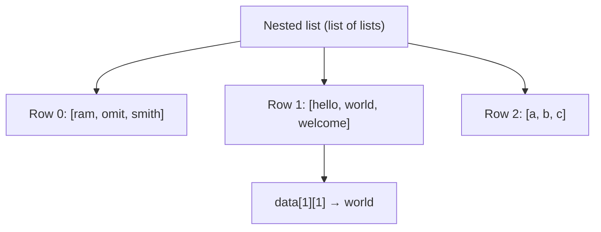
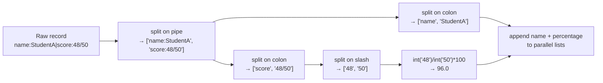

# Problem Solving with Python: Strings, Lists, and Data Pre-processing

## PPT Link: [Session 9](https://coding-platform.s3.amazonaws.com/dev/lms/tickets/1d7b35db-6227-466d-82cc-6f83659114ad/vBT2VgJVdFKx1QBo.pdf)


## Collab Practice Code: [PY_Session_9](https://coding-platform.s3.amazonaws.com/dev/lms/tickets/5a432c0f-fc2f-4ae7-9c4b-3a4d9c3fc9c0/HqW2ItYUrhOXIRNx.ipynb)


## 1. What You'll Learn in This Section

In this lesson, you'll learn to:

- Explain how Python modules work and why you must restart the runtime after changing an imported file.
- Manipulate strings using indexing, slicing, concatenation, type casting, comparison, and cleaning methods.
- Build and modify lists using append, insert, pop, sort, and statistical functions.
- Apply a step-by-step decomposition strategy to parse and rank messy real-world data stored in a pipe-delimited format.

---

## 2. Detailed Explanation

### Python modules and the restart-session requirement

A **module** is a Python file you import into your notebook or script to reuse the functions inside it.

**Why it matters**

When you modify the file after importing it, your notebook does not automatically pick up the new version. Python keeps the old (cached) version in memory. This trips up many beginners who edit a file and wonder why nothing changed.

**Walkthrough**

Say you have a file called `my_new_file_1.py` with two functions:

```python
# my_new_file_1.py

def message(text):
    print(f"hello {text}")

def double_number(x):
    return 2 * x
```

You can import it like this:

```python
import my_new_file_1 as f1
```

The name `f1` is an **alias** — a short nickname for the module. Using `f1` is functionally identical to writing `my_new_file_1` every time.

After you edit `message`, those changes stay invisible until you go to **Runtime → Restart session**. Once you restart, calling `f1.double_number(5)` returns `10` and `f1.message(10)` prints `hello 10`.

**Common mistakes**

- Forgetting to restart after editing the module file — you'll keep seeing the old behaviour.
- Assuming an alias changes what the module does — it is only a shorter reference, nothing more.

---

### Strings — basics, indexing, and slicing

A **string** is a sequence of characters. You can write a string literal with single quotes or double quotes — both work the same way. Example: `str1 = "hello"`.

**Why it matters**

Almost every real-world dataset contains text — names, addresses, dates, log entries. Understanding how to read individual characters and extract substrings is the starting point for all text processing.

**Walkthrough**

Each character sits at a numbered position called an **index**, starting at `0`.

| Index | 0 | 1 | 2 | 3 | 4 |
|-------|---|---|---|---|---|
| Char  | a | p | p | l | e |

```python
fruit = "apple"
print(fruit[0])   # a
print(fruit[3])   # l
print(len(fruit)) # 5 — len() counts all characters including spaces
```

**Slicing** extracts a chunk of the string using `[start:end]`. The character at `start` is included; the character at `end` is excluded.

```python
text = "India"
print(text[0:5])  # India   — indices 0, 1, 2, 3, 4
print(text[2:])   # dia     — from index 2 to the end
print(text[:3])   # Ind     — from index 0 up to (not including) index 3
```

Omitting `start` defaults to `0`; omitting `end` defaults to the last character.

**Common mistakes**

- Using `fruit[5]` on a 5-character string — valid indices are `0` through `4`; `5` raises an `IndexError`.
- Expecting `text[0:5]` to include index `5` — the end index is always excluded.

---

### String concatenation and type casting

**Concatenation** means joining two strings end-to-end using the `+` operator. **Type casting** means converting a value from one data type to another — for example, turning the string `"123"` into the integer `123`.

**Why it matters**

Data often arrives with numbers stored as text. You cannot do arithmetic on a string like `"48"` without converting it first. Understanding both operations is essential before you can do any calculation on imported data.

**Walkthrough**

```python
str1 = "hello"
str2 = " world"
print(str1 + str2)   # hello world

str3 = "12345"
number = int(str3) + 1   # 12346 — cast to int before adding
```

Trying arithmetic directly on `str3` without casting raises a `TypeError`.

You can convert back in the other direction too: `str(12345)` turns an integer into the string `"12345"`.

**Common mistakes**

- Writing `"5" + 3` — Python will not silently convert; it raises a `TypeError`.
- Using `int()` on a string that contains letters or symbols — that raises a `ValueError`.

---

### String comparison

Strings are compared in alphabetical (dictionary) order. A string that comes earlier in the dictionary is considered **less than** one that comes later.

**Why it matters**

Sorting names alphabetically or checking whether one label precedes another relies on string comparison. Python uses the same rules as a dictionary.

**Walkthrough**

```python
word = "apple"
if word == "banana":
    print("equal to banana")
elif word < "banana":
    print("apple comes before banana")   # this runs — 'a' < 'b'
```

Change `word` to `"orange"` and neither branch runs, because `'o'` comes after `'b'`.

**Common mistakes**

- Comparing strings with numeric operators without realising the comparison is character-by-character from left to right.
- Mixing upper- and lower-case letters — Python treats `"Banana"` and `"banana"` as different strings because uppercase letters have lower ASCII values.

---

### String immutability and case methods

Strings are **immutable**: you cannot change a single character by index assignment. Attempting it raises a `TypeError`.

**Why it matters**

This surprises many beginners who assume strings work like lists. Knowing this rule prevents frustrating bugs when you try to "fix" a character in place.

**Walkthrough**

```python
fruit = "Banana"
# fruit[0] = "p"   # TypeError — not allowed

print(fruit.lower())   # banana
print(fruit.upper())   # BANANA
```

Use `.lower()` or `.upper()` when you need a case-changed version. They return a new string — the original is unchanged.

**Common mistakes**

- Expecting `fruit[0] = "p"` to work — use `.replace()` or build a new string instead.
- Forgetting that `.lower()` returns a new string; writing `fruit.lower()` without assigning it does not change `fruit`.

---

### String cleaning methods

Python provides several built-in methods to clean raw text data. They are used constantly when pre-processing data that arrives with extra spaces, wrong case, or unwanted symbols.

**Why it matters**

A backend engineer downloading user data from a database often encounters trailing spaces, mixed case, or currency symbols in numeric fields. Cleaning the text before analysis is a mandatory first step.

**Walkthrough**

| Method | Effect |
|--------|--------|
| `.strip()` | Removes leading and trailing whitespace |
| `.lstrip()` | Removes leading (left) whitespace only |
| `.rstrip()` | Removes trailing (right) whitespace only |
| `.lower()` | Converts all characters to lower case |
| `.upper()` | Converts all characters to upper case |
| `.replace(old, new)` | Replaces every occurrence of `old` with `new` |

Methods can be **chained** — the output of one becomes the input of the next:

```python
text = "   some email   "
clean_email = text.strip().lower()   # "some email"
```

When a price is stored as `"$1,200.50"`, remove the symbols before converting to a number:

```python
price = "$1,200.50"
number = float(price.replace("$", "").replace(",", ""))
# replace("$", "") → "1,200.50"
# replace(",", "") → "1200.50"
# float(...)       → 1200.5
```

**Common mistakes**

- Calling `.strip()` but forgetting to assign the result — strings are immutable, so the cleaned version must be saved to a variable.
- Applying `.replace()` only once when there are two different symbols to remove (e.g., both `$` and `,`).

---

### Splitting and joining strings

`.split(separator)` breaks a string into a **list** of substrings wherever the separator appears. The separator itself is removed. `.join()` is the reverse — it concatenates a list of strings into one, inserting a connector between each element.

**Why it matters**

Log files, CSV exports, and legacy data systems often store multiple fields in a single string separated by a special character (a pipe `|`, a comma `,`, or a colon `:`). Splitting is how you pull those fields apart.

**Walkthrough**

```python
log_line = "2026-05-18|ERROR|database connection failed"
parts = log_line.split("|")
# parts == ["2026-05-18", "ERROR", "database connection failed"]
print(parts[0])   # 2026-05-18
print(parts[1])   # ERROR
```

You can split on any character or substring — a pipe `|`, comma `,`, space ` `, colon `:`, or slash `/`.

To go the other way, use `.join()`:

```python
words = ["Python", "analytics", "IIT"]
result  = ",".join(words)   # "Python,analytics,IIT"
result2 = " ".join(words)   # "Python analytics IIT"
```

The string before `.join` is the connector placed between every consecutive pair of elements.

**Common mistakes**

- Expecting `.split()` to keep the separator — it discards it.
- Confusing the order: the connector goes *before* `.join(list)`, not inside the list.

---

### Lists — basics and mutability

A **list** is a collection that stores multiple values — strings, numbers, or a mix — in a single variable. Each element is accessed by its index, starting at `0`. Unlike strings, lists are **mutable**: you can replace any element by index assignment.

**Why it matters**

Lists are the primary way to hold a dataset in memory before processing it. Being able to update individual elements is what makes them useful for tasks like filling in cleaned values.

**Walkthrough**

```python
friends = ["dev_lead", "analyst", "designer"]
print(friends[0])   # dev_lead
print(friends[2])   # designer

numbers = [2, 14, 26, 41, 63]
numbers[2] = 20     # replaces 26 with 20
# numbers is now [2, 14, 20, 41, 63]
```

Slicing and concatenation work the same way as for strings:

```python
t = [8, 9, 14, 21, 23, 41, 55]
print(t[1:3])   # [9, 14]
print(t[:4])    # [8, 9, 14, 21]

list_a = [1, 2, 3]
list_b = [4, 5, 6]
combined = list_a + list_b   # [1, 2, 3, 4, 5, 6]
```

**Common mistakes**

- Treating a list like a string and expecting `list[0] = value` to fail — it works fine for lists but not for strings.
- Forgetting that slicing returns a new list and does not modify the original.

---

### Modifying a list: append, insert, pop

Three methods cover the most common list-modification operations.

**Why it matters**

Building up a results list inside a loop — as in the student-records exercise — depends on `append`. Inserting at a position or removing processed items relies on `insert` and `pop`.

**Walkthrough**

```python
queue = ["eng_01", "eng_02"]
queue.append("eng_03")      # → ["eng_01", "eng_02", "eng_03"]
queue.insert(1, "eng_04")   # → ["eng_01", "eng_04", "eng_02", "eng_03"]
served = queue.pop(0)       # removes "eng_01", served == "eng_01"
# queue → ["eng_04", "eng_02", "eng_03"]
```

- **`append(value)`** adds an element at the end.
- **`insert(index, value)`** inserts at the specified position, shifting existing elements right.
- **`pop(index)`** removes and returns the element at the given index.

**Common mistakes**

- Confusing `append` and `insert` — `append` always goes to the end; `insert` needs an index.
- Discarding the return value of `pop` when you actually needed the removed element.

---

### Sorting, reversing, and statistical functions

Python provides in-place sorting and built-in statistical functions for lists.

**Why it matters**

Finding the highest score, computing an average, or sorting a leaderboard are everyday data tasks. These functions handle them in one line each.

**Walkthrough**

```python
scores = [56, 12, 78, 34]
scores.sort()               # [12, 34, 56, 78]  — ascending, in place
scores.sort(reverse=True)   # [78, 56, 34, 12]  — descending, in place
```

For statistical operations:

```python
numbers = [56, 12, 78, 34, 90]
print(max(numbers))                      # 90
print(min(numbers))                      # 12
print(sum(numbers))                      # 270
print(len(numbers))                      # 5
average = sum(numbers) / len(numbers)    # 54.0
```

To locate a value, use `.index()` and `.count()`:

```python
numbers.index(78)    # returns the index of the first occurrence of 78
numbers.count(78)    # returns how many times 78 appears
```

`.index()` returns only the **first** matching position. If the same value appears more than once, only the index of its first occurrence is returned.

**Common mistakes**

- Calling `.sort()` and expecting the original list to be unchanged — `.sort()` modifies the list in place.
- Using `.index()` when duplicate values exist and assuming it finds all of them — it finds only the first.

---

### Nested lists and 2-D arrays

A **nested list** is a list that contains other lists. This creates a two-dimensional structure — like a spreadsheet with rows and columns.

**Why it matters**

Real datasets are 2-D: rows of records, each with multiple columns. Representing this as a list of lists is the foundation for data engineering work and the format that machine learning libraries expect.

**Walkthrough**

```python
matrix = [[1, 2], [3, 4]]
# matrix[0]    → [1, 2]  (first row)
# matrix[1]    → [3, 4]  (second row)
# matrix[1][1] → 4       (row 1, column 1)
```

The outer index selects the row; the inner index selects the element within that row.

```python
data = [
    ["ram",   "omit",  "smith"],
    ["hello", "world", "welcome"],
    ["a",     "b",     "c"]
]
print(data[1][1])   # "world" — row 1, element 1
```



**Common mistakes**

- Using a single index `data[1]` when you want a specific element — that returns the whole row, not one cell.
- Mixing up the order of indices: outer index is the row, inner index is the column.

---

### Problem-solving with decomposition: parsing and ranking student records

**Decomposition** means breaking a large problem into small, independently solvable sub-problems. Solve the logic for one record first, then wrap it in a loop.

**Why it matters**

Raw data from legacy systems rarely arrives in a clean format. A data engineer must parse, clean, and restructure it before any analysis can happen. Decomposition is the primary strategy that makes this manageable.

**Walkthrough**

The input is a list of messy pipe-delimited records:

```text
name:StudentA|score:48/50
name:StudentB|score:47/50
name:StudentC|score:45/50
```

The goal is to extract each student's name, convert the score to a percentage, and find the top scorer.



Here is the full solution:

```python
raw_records = [
    "name:StudentA|score:48/50",
    "name:StudentB|score:47/50",
    "name:StudentC|score:45/50"
]

final_names = []
final_marks = []

for temp in raw_records:
    record = temp.split("|")          # ["name:StudentA", "score:48/50"]
    name   = record[0].split(":")[1]  # "StudentA"
    text   = record[1].split(":")     # ["score", "48/50"]
    mark   = text[1].split("/")       # ["48", "50"]
    pct    = int(mark[0]) / int(mark[1]) * 100
    final_names.append(name)
    final_marks.append(pct)

max_mark  = max(final_marks)
max_index = final_marks.index(max_mark)
top_name  = final_names[max_index]
print(top_name, max_mark)             # StudentA 96.0
```

The **parallel list** pattern is the key insight: `final_names` and `final_marks` are built in the same loop in the same order, so the element at `max_index` in one list corresponds to the element at `max_index` in the other.

An **edge case** to watch for: if two students share the same highest score, `.index()` returns only the first match. Handling ties would require scanning all positions where the value equals the maximum.

**Problem-solving principles used:**

- **Decomposition** — split the big task into small string operations; verify each step before continuing.
- **Step-by-step validation** — print intermediate results after each step to confirm the output.
- **Parallel lists** — two lists sharing the same index let you look up related data instantly.
- **Multiple correct solutions** — the same problem can be solved many ways; shorter code and fewer variables generally reduce memory and execution overhead.

**Common mistakes**

- Jumping straight to writing the loop without testing the logic on a single record first.
- Forgetting that `.index()` finds only the first match when there are duplicates.

---

### Data pre-processing and its role in machine learning

**Pre-processing** means cleaning and transforming raw data into a structured format suitable for analysis or machine learning.

**Why it matters**

Raw data downloaded from online sources typically cannot be fed directly into a machine learning model. It must first be cleaned (removing unwanted characters, fixing formats), filtered, and restructured — often into a list of lists (a 2-D array) — before being passed to machine learning methods. This cleaning step is often the most time-consuming part of any data science project.

**Walkthrough**

The string and list operations covered above are the foundational tools for that cleaning work:

| Operation | Pre-processing use |
|-----------|--------------------|
| `.strip()`, `.replace()` | Remove extra whitespace and unwanted symbols |
| `.split()` | Break delimited fields into separate values |
| `int()`, `float()` | Convert text-stored numbers to numeric types |
| `list.append()` | Build up a cleaned dataset row by row |
| Nested lists | Represent the final cleaned dataset as rows and columns |

**Common mistakes**

- Assuming downloaded data is clean and skipping pre-processing — this leads to errors or silent incorrect results downstream.
- Performing pre-processing steps in the wrong order (for example, trying to cast to `int` before removing the `$` symbol).

---

## 3. Key Takeaways

- **Restart after editing a module.** Python caches imported files; use Runtime → Restart session to load any changes you made to a `.py` file.
- **Strings are sequences with 0-based indexing and are immutable.** Use slicing (`[start:end]`), `.replace()`, `.strip()`, `.split()`, and `.join()` to extract and clean text.
- **Type casting converts between types.** Use `int()`, `float()`, or `str()` before doing arithmetic on numeric strings; skipping this raises a `TypeError`.
- **Lists are mutable sequences.** Use `append`, `insert`, `pop`, `sort`, `max`, `min`, `sum`, and `len` to build and analyse collections of data.
- **Nested lists represent 2-D data.** Access a cell with `data[row][col]`; this structure is the bridge between raw data and machine learning inputs.
- **Decompose before you code.** Solve the logic for one record, validate it step by step, then wrap it in a loop.
- **The parallel list pattern** links two lists by a shared index, so position `i` in one list always corresponds to position `i` in the other.

**Mental model:** Think of a string as a read-only row of labelled boxes and a list as a rewritable row of labelled boxes. Both use the same address system (0-based index and slicing), but only the list lets you swap what's inside a box.